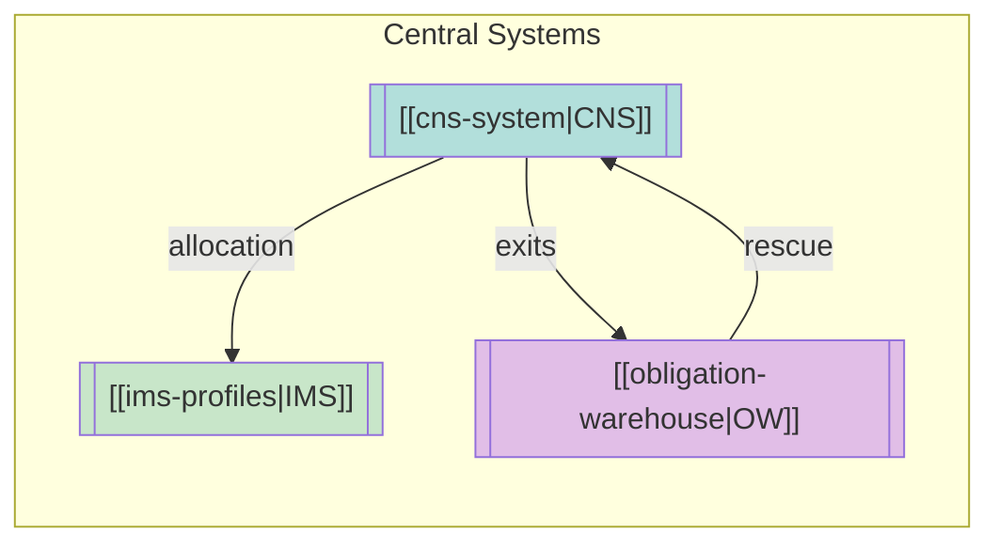

# Fail Monitoring Knowledge Base

Central navigation hub for settlement fail monitoring, prioritization, and resolution.

---

## Quick Navigation

### Maps of Content
- [[_MOC-settlement|Settlement Systems]] - CNS, IMS, DTC infrastructure
- [[_MOC-regulations|Regulatory Framework]] - Reg SHO, Rule 15c3-1, FINRA rules
- [[_MOC-exceptions|Exception Processing]] - Reclaims, recalls, buy-ins, DK resolution

---

## Core Concepts

### Settlement Infrastructure

| System | Function | Key Pages |
|--------|----------|-----------|
| [[cns-system\|CNS]] | Netting & novation | [[novation]], [[netting]], [[priority-groups]] |
| [[ims-profiles\|IMS]] | Inventory control | [[collateral-monitor]], [[net-debit-cap]] |
| [[obligation-warehouse\|OW]] | Bilateral settlement | [[recaps]], [[cns-eligibility-scan]] |

### Fail Lifecycle
| Stage | Key Page | Triggers |
|-------|----------|----------|
| Trade | [[settlement-lifecycle]] | T+0 comparison |
| Settlement | [[night-cycle]], [[day-cycle]] | Allocation attempts |
| Fail | [[fail-to-deliver]], [[fail-to-receive]] | 3:00 PM cutoff |
| Escalation | [[cns-fails-charge]], [[aged-fail-deductions]] | Age thresholds |
| Resolution | [[buy-in-mechanics]], [[close-out-matrix]] | Reg SHO deadlines |

### Regulatory Framework
| Rule | Scope | Key Page |
|------|-------|----------|
| Reg SHO 204 | Close-out deadlines | [[reg-sho-rule-204]] |
| Rule 15c3-1 | Capital deductions | [[aged-fail-deductions]] |
| NSCC Rule 11 | CNS buy-ins | [[buy-in-mechanics]] |
| FINRA 11810 | Bilateral buy-ins | [[buy-in-mechanics]] |

---

## Decision Trees

| Tree | Purpose | Entry Point |
|------|---------|-------------|
| [[settlement-lifecycle]] | 8-node settlement flow | Trade comparison |
| [[new-fail-triage]] | New fail processing | Fail alert |
| [[escalation-paths]] | Escalation matrix | Age/value triggers |

---

## Reference

### Copilot Prompts
- [[copilot-prompts]] - 13 step-by-step prompts for fail resolution

### Quick Lookup
- [[t1-critical-deadlines]] - Cutoff times
- [[close-out-matrix]] - S+1/S+3/S+13 deadlines
- [[fail-charge-schedule]] - Aging charge rates
- [[priority-score-formula]] - Scoring calculation

### Data Model
- [[data-sources]] - Feed specifications
- [[fail-lifecycle]] - State machine
- [[entity-relationships]] - Database schema

---

## By Folder

| Folder | Contents |
|--------|----------|
| [[01-data-model/\|01-data-model]] | Entity definitions, data sources |
| [[02-business-rules/\|02-business-rules]] | Prioritization, Reg SHO, offsets |
| [[03-decision-trees/\|03-decision-trees]] | Triage, escalation, lifecycle |
| [[04-sessions/\|04-sessions]] | Meeting notes |
| [[05-systems/\|05-systems]] | CNS, IMS, OW documentation |
| [[06-regulations/\|06-regulations]] | Regulatory deep dives |
| [[07-reference/\|07-reference]] | Timelines, formulas, codes |
