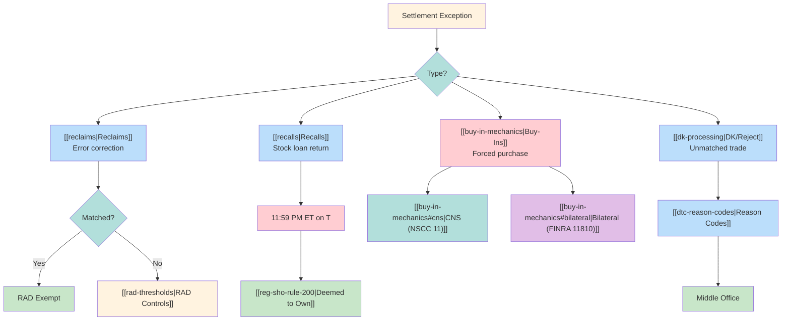
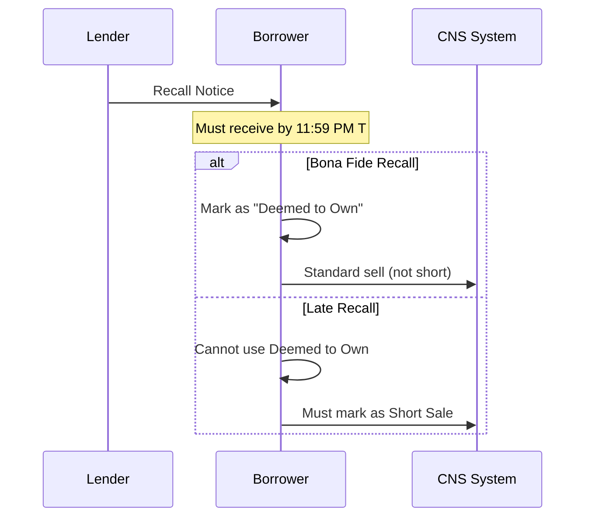

# Exception Processing

Map of Content for settlement exceptions: reclaims, recalls, buy-ins, DK resolution.

---

## Exception Taxonomy

---

## Reclaims

> [!info] Error Correction
> Reclaims reverse erroneous deliveries. Treated as new delivery instructions subject to [[rad-thresholds|RAD controls]].

### Reclaim Types
| Code Range | Type | Page |
|------------|------|------|
| 41-44 | DK Reclaims | [[reclaims#dk]] |
| 45 | Mutilated/Wrong | [[reclaims#wrong]] |
| 87-88 | Late/Stale | [[reclaims#late]] |

### Processing Rules
| Scenario | RAD Applied? | Processing |
|----------|--------------|------------|
| Matched reclaim | No | Immediate |
| Unmatched reclaim | Yes | Subject to limits |
| Decoupled (Q3 2027) | TBD | New framework |

See [[reclaim-reason-codes]] for full code reference.

---

## Recalls

> [!warning] Bona Fide Deadline
> Recall notices must be received by **11:59 PM ET on T** to qualify as "bona fide" for [[reg-sho-rule-200|Deemed to Own]] marking.

### Recall Workflow

### Key Constraints
| Factor | T+2 Era | T+1 Era |
|--------|---------|---------|
| Bona fide deadline | 3:00 PM T+1 | 11:59 PM T |
| Settlement pressure | Moderate | High |
| HTB impact | Manageable | Critical |

See [[recalls]] for full mechanics.

---

## Buy-Ins

### CNS Buy-In (NSCC Rule 11)
| Step | Action | Impact |
|------|--------|--------|
| 1 | Submit Intent | Position flagged |
| 2 | Priority Group 2 | Elevated allocation |
| 3 | Retransmittal | Oldest short notified |
| 4 | Execution | Market purchase |

### Bilateral Buy-In (FINRA 11810)
| Step | Action | Timing |
|------|--------|--------|
| 1 | Written Notice | 12:00 PM, T-2 |
| 2 | In Transit Check | 7-day extension if yes |
| 3 | Execution | Market purchase |
| 4 | Billing | Difference to seller |

See [[buy-in-mechanics]] for detailed comparison.

---

## DK Processing

> [!note] Don't Know
> DK indicates counterparty doesn't recognize the trade. Triggers middle office investigation.

### DK Reason Codes
| Code | Meaning | Resolution Path |
|------|---------|-----------------|
| 41 | Unknown trade | Trade comparison |
| 42 | Wrong quantity | Amendment |
| 43 | Wrong price | Amendment |
| 44 | Wrong security | Amendment |

### Resolution Workflow
1. DK received → [[dk-processing]]
2. Reason code analysis → [[dtc-reason-codes]]
3. Middle office investigation
4. Amendment or cancellation
5. Re-submission to [[obligation-warehouse]] or [[cns-system]]

---

## Exception Prioritization

| Exception Type | Priority Factor | Escalation Trigger |
|----------------|-----------------|-------------------|
| Reg SHO deadline | [[reg-sho-rule-204]] | S+1/S+3 approach |
| High value reclaim | > $1M | Immediate |
| Threshold security | [[threshold-securities]] | Any age |
| Aged DK | > 5 days | Senior ops |

Integration with [[prioritization-logic]] and [[new-fail-triage]].

---

## Related
- [[_MOC-settlement]] - Systems where exceptions occur
- [[_MOC-regulations]] - Regulatory drivers of exceptions
- [[escalation-paths]] - Escalation matrix for exceptions
