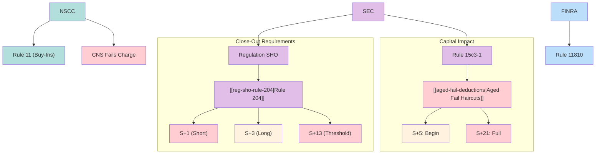
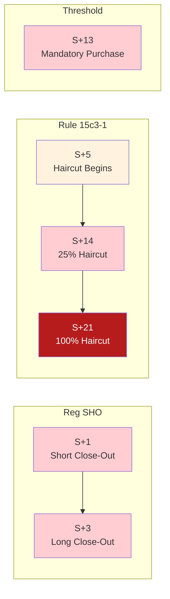

# Regulatory Framework

Map of Content for settlement regulations: Reg SHO, Rule 15c3-1, NSCC/FINRA rules.

---

## Regulatory Hierarchy

---

## Regulation SHO

> [!warning] Delivery-Centric Model
> Reg SHO shifted from "locate-centric" to "delivery-centric" - hard close-out requirements override trading discretion.

### Core Rules
| Rule | Page | Function |
|------|------|----------|
| 200 | [[reg-sho-rule-200]] | Order marking (Long/Short/Short Exempt) |
| 203 | [[threshold-securities]] | Locate & threshold list |
| 204 | [[reg-sho-rule-204]] | Mandatory close-out deadlines |

### Close-Out Matrix
| Position Type | Deadline | Consequence |
|---------------|----------|-------------|
| Short sale fail | S+1 market open | [[penalty-box]] |
| Long sale fail | S+3 market open | [[penalty-box]] |
| Market maker | S+3 (extended) | [[penalty-box]] |
| [[threshold-securities\|Threshold]] | S+13 | Mandatory purchase |

### Penalty Box
See [[penalty-box]] for pre-borrow restriction mechanics:
- Destroys trading economics (10-100%+ APR for HTB)
- Applies firm-wide per security
- Exit only via "cleared and settled" delivery

---

## Rule 15c3-1 (Net Capital)

> [!danger] Capital at Risk
> Aged fails trigger capital deductions that can force business cessation.

### Haircut Schedule
| Age | Deduction | Page |
|-----|-----------|------|
| S+5 | Begins | [[aged-fail-deductions]] |
| S+7 | 15% | [[aged-fail-deductions]] |
| S+14 | 25% | [[aged-fail-deductions]] |
| S+21 | 100% | [[aged-fail-deductions]] |

### Impact
- Reduces excess net capital
- May trigger early warning thresholds
- Affects business capacity

---

## NSCC Rules

### Rule 11: CNS Buy-Ins
See [[buy-in-mechanics]] for CNS buy-in workflow:
1. Submit Buy-In Intent
2. Position elevated to [[priority-groups|Priority Group 2]]
3. Retransmittal Notice to oldest short
4. Market execution if unresolved

### CNS Fails Charge
See [[cns-fails-charge]] for duration-based penalties:

| Age | Rate |
|-----|------|
| 1-4 days | 5% |
| 5-10 days | 15% |
| 11-20 days | 20% |
| 21+ days | 100% |

---

## FINRA Rules

### Rule 11810: Bilateral Buy-Ins
See [[buy-in-mechanics]] for bilateral process:
- 2-business-day written notice required
- 7-day extension if securities "in transit"
- Difference billed to failing party

---

## Compliance Timelines

---

## Related
- [[_MOC-settlement]] - Settlement systems subject to regulations
- [[_MOC-exceptions]] - Exception processing for compliance
- [[close-out-matrix]] - Quick reference for all deadlines
