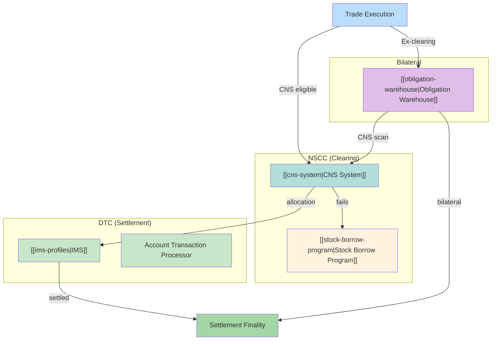

# Settlement Systems

Map of Content for settlement infrastructure: CNS, IMS, Obligation Warehouse, and DTC mechanics.

---

## System Overview

---

## CNS System

> [!info] Central Counterparty
> CNS provides [[novation]] - transforming bilateral trades into CCP-guaranteed obligations with 98% [[netting]] efficiency.

### Core Pages
| Page | Topic |
|------|-------|
| [[cns-system]] | Architecture overview |
| [[novation]] | Legal transformation via CCP |
| [[netting]] | Continuous netting mechanics |
| [[priority-groups]] | Allocation hierarchy (1-4) |

### Processing Cycles
| Page | Timing |
|------|--------|
| [[night-cycle]] | ~11:30 PM ET (S-1) |
| [[day-cycle]] | Settlement date continuous |
| [[partial-settlement]] | Intraday partial delivery |

### Fail Mitigation
| Page | Function |
|------|----------|
| [[stock-borrow-program]] | SBP mechanics |
| [[cns-fails-charge]] | Duration-based penalties |

---

## IMS (Inventory Management System)

> [!info] Settlement Control
> IMS controls delivery sequencing via [[ims-profiles|profile system]] (Green/Yellow/Red) and enforces [[collateral-monitor|solvency]] and [[net-debit-cap|liquidity]] limits.

### Core Pages
| Page | Topic |
|------|-------|
| [[ims-profiles]] | Green/Yellow/Red automation |
| [[collateral-monitor]] | CM calculation & triggers |
| [[net-debit-cap]] | $2.15B individual cap |

### Optimization
| Page | Function |
|------|----------|
| [[look-ahead-process]] | 2-minute gridlock resolution |
| [[settlement-progress-payment]] | SPP Fedwire mechanism |

---

## Obligation Warehouse

> [!info] Bilateral Settlement
> OW handles ex-clearing trades without CCP guarantee. Tracks ~trillions in off-CCP liabilities.

### Core Pages
| Page | Topic |
|------|-------|
| [[obligation-warehouse]] | Architecture overview |
| [[recaps]] | Mark-to-market repricing |
| [[cns-eligibility-scan]] | Daily rescue mechanism |
| [[dk-processing]] | Don't Know resolution |

---

## Cross-System Flows

### CNS → OW (Exits)
Positions exit CNS to OW when:
- Security becomes CNS-ineligible
- Member requests ex-clearing
- ACATS non-CNS transfers

### OW → CNS (Rescue)
Daily [[cns-eligibility-scan]] promotes eligible OW positions back to CNS.

### CNS → IMS (Allocation)
[[night-cycle]] and [[day-cycle]] allocations flow to IMS for delivery sequencing based on [[ims-profiles]].

---

## Related
- [[_MOC-regulations]] - Regulatory requirements affecting settlement
- [[_MOC-exceptions]] - Exception handling across systems
- [[settlement-lifecycle]] - 8-node decision tree
