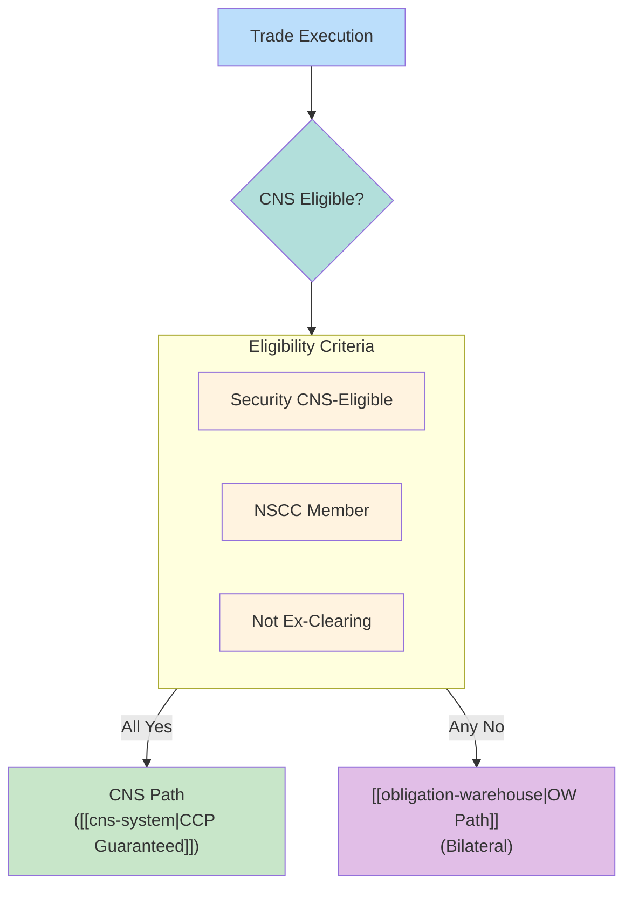
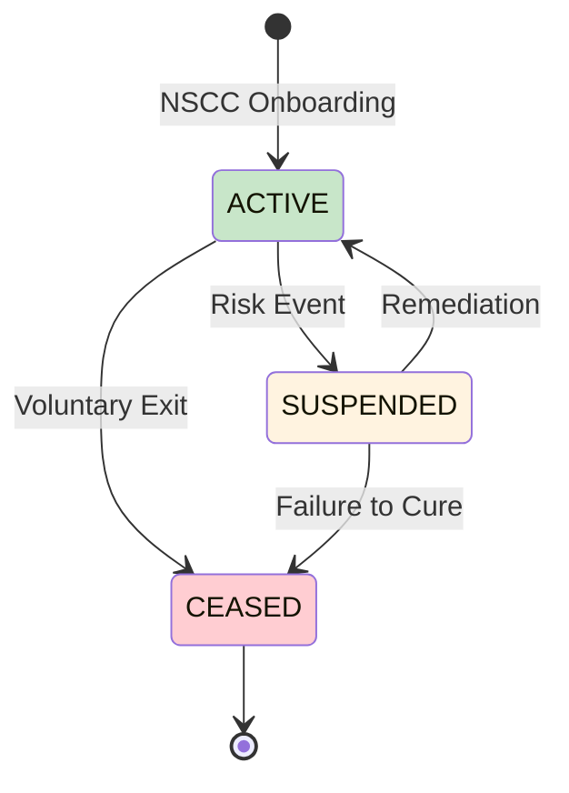

# CNS Counterparty Eligibility

Determines whether a counterparty can participate in CNS (Continuous Net Settlement). Eligibility affects settlement path, capital treatment, and fail management.

---

## Eligibility Decision Flow



---

## Eligibility Criteria

### 1. Security Eligibility
| Criterion | Requirement | Validation |
|-----------|-------------|------------|
| CUSIP-based | Must have valid CUSIP | CUSIP lookup |
| USD-denominated | US dollar settlement | Currency check |
| DTC-eligible | Book-entry at DTC | DTC eligibility list |
| Not restricted | No trading restrictions | Security master |

### 2. Member Eligibility
| Criterion | Requirement | Validation |
|-----------|-------------|------------|
| NSCC membership | Active NSCC member | Membership directory |
| Good standing | No suspension | NSCC status |
| Clearing fund | Adequate deposit | Fund calculation |
| Risk rating | Acceptable profile | NSCC risk assessment |

### 3. Trade Eligibility
| Criterion | Requirement | Validation |
|-----------|-------------|------------|
| Trade type | Standard equity | Trade code |
| Not ex-cleared | No bilateral election | Trade flag |
| Matched | Both parties confirm | Comparison status |
| Timely submission | Before cutoff | Timestamp |

---

## Impact of CNS vs. Non-CNS

| Aspect | CNS-Eligible | Non-CNS (OW) |
|--------|--------------|--------------|
| Counterparty | NSCC (CCP) | Trading partner |
| Guarantee | NSCC guarantee | None |
| Booking | Net position | Gross exposure |
| Capital | Favorable (CCP risk weight) | Higher (counterparty risk) |
| Margin | Offsets allowed | No offsets |
| Fail treatment | [[cns-fails-charge]] | Balance sheet + haircuts |
| Buy-in | NSCC Rule 11 | FINRA 11810 |

### Capital Treatment
| Position Type | CNS (CCP) | Bilateral |
|---------------|-----------|-----------|
| Risk weight | ~2% (CCP exposure) | 20-100% (CP dependent) |
| Margin benefit | Yes | No |
| Balance sheet | Net | Gross |

---

## Counterparty Data Quality

### Required Data Elements
| Field | Description | Quality Check |
|-------|-------------|---------------|
| NSCC participant ID | NSCC member number | Validate against directory |
| DTC participant number | DTC account | Validate against DTC |
| Legal Entity Identifier (LEI) | Global identifier | LEI registry lookup |
| BIC/SWIFT | International ID | SWIFT directory |

### Common Data Issues
| Issue | Impact | Resolution |
|-------|--------|------------|
| Stale membership status | Trade routed wrong | Daily membership refresh |
| Wrong participant number | Trade fails comparison | Correct in counterparty master |
| Missing LEI | Regulatory reporting issues | Collect from counterparty |
| Inactive status | Trade rejected | Verify before execution |

---

## Eligibility Lifecycle



### Status Changes
| Status | Trading Impact | Settlement Impact |
|--------|----------------|-------------------|
| Active | Normal trading | CNS eligible |
| Suspended | Trading halted | Existing positions settle |
| Ceased | No new trades | Wind-down only |

---

## Monitoring Integration

### Pre-Trade Checks
| Check | Timing | System |
|-------|--------|--------|
| Membership status | Order entry | OMS |
| Security eligibility | Pre-execution | Trading system |
| Credit limit | Pre-allocation | Risk system |

### Post-Trade Validation
| Check | Timing | System |
|-------|--------|--------|
| CNS eligibility confirm | Trade capture | Middleware |
| Settlement path routing | Comparison | [[settlement-lifecycle]] |
| CP status change alert | Continuous | CP master |

---

## T+1 Considerations

> [!warning] Real-Time Validation Required
> T+1 leaves no time for manual eligibility fixes. Pre-trade validation is mandatory.

| Challenge | T+1 Impact |
|-----------|------------|
| Late affirmation | Misses 9:00 PM cutoff, goes to [[day-cycle]] |
| Eligibility change mid-day | Trade may route wrong |
| New counterparty | Must onboard before trade |

---

## Data Model

```yaml
webapp_entity: "Counterparty"
webapp_fields:
  - name: counterparty_id
    type: UUID
  - name: legal_name
    type: VARCHAR
  - name: nscc_participant_id
    type: VARCHAR(5)
    description: "NSCC member number"
  - name: dtc_participant_number
    type: VARCHAR(4)
    description: "DTC account"
  - name: lei
    type: VARCHAR(20)
    description: "Legal Entity Identifier"
  - name: bic_code
    type: VARCHAR(11)
  - name: cns_eligible
    type: BOOLEAN
    description: "Currently CNS eligible"
  - name: membership_status
    type: ENUM
    values: ["ACTIVE", "SUSPENDED", "CEASED"]
  - name: clearing_fund_balance
    type: DECIMAL
  - name: risk_rating
    type: VARCHAR
  - name: last_validated
    type: TIMESTAMP
```

---

## CP Eligibility Flags in Fail Monitor

| Flag | Meaning | Priority Impact |
|------|---------|-----------------|
| CNS_ELIGIBLE | Standard CNS participant | Normal |
| NON_CNS | Bilateral only | Higher attention |
| SUSPENDED | Trading suspended | Critical |
| WATCH_LIST | Elevated risk | Higher priority |
| PROBLEM_CP | History of fails | [[prioritization-logic]] boost |

---

## Integration Points

| System | Integration |
|--------|-------------|
| [[data-sources]] | CP master feed |
| [[entity-relationships]] | Counterparty entity |
| [[settlement-lifecycle]] | Node 1 eligibility check |
| [[prioritization-logic]] | CP factor in scoring |
| [[obligation-warehouse]] | Non-CNS path |

---

## Related
- [[cns-system]] - CNS architecture
- [[obligation-warehouse]] - Non-CNS settlement
- [[settlement-lifecycle]] - Node 1 eligibility decision
- [[ssi-mismatches]] - Settlement instruction issues
- [[im-data-quality]] - Investment Manager data
- [[entity-relationships]] - Data model
- [[prioritization-logic]] - CP factor in scoring
