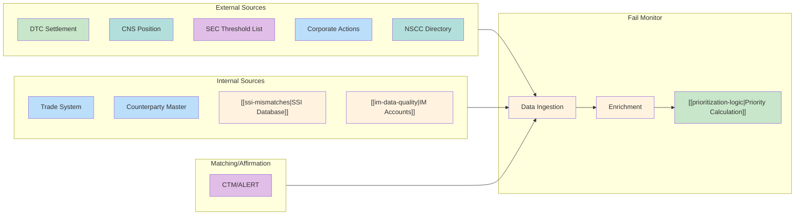

# Data Sources

Catalogs all data sources feeding into the fail monitoring system.

---

## Data Flow Overview

---

## Primary Sources

### 1. DTC Settlement Files
| Aspect | Detail |
|--------|--------|
| Frequency | Daily |
| Format | Fixed-width text |
| Key Fields | CUSIP, quantity, counterparty, settlement date |
| Use | Identifies settled and failed transactions |
| Related | [[ims-profiles]], [[settlement-lifecycle]] |

### 2. CNS Position Reports
| Aspect | Detail |
|--------|--------|
| Frequency | Daily |
| Format | CSV |
| Key Fields | Net position, obligation type, aging |
| Use | Tracks [[cns-system]] fail positions and aging |
| Related | [[fail-to-deliver]], [[fail-to-receive]], [[cns-fails-charge]] |

### 3. Internal Trade System
| Aspect | Detail |
|--------|--------|
| Frequency | Real-time |
| Format | API/Database |
| Key Fields | Trade ID, execution date, expected settlement |
| Use | Links fails to original trade details |
| Related | [[entity-relationships]] |

### 4. IMS Activity Reports
| Aspect | Detail |
|--------|--------|
| Frequency | Intraday |
| Format | API/Reports |
| Key Fields | Profile status, delivery status, RAD events |
| Use | Track delivery sequencing and blocks |
| Related | [[ims-profiles]], [[rad-thresholds]] |

### 5. Obligation Warehouse Reports
| Aspect | Detail |
|--------|--------|
| Frequency | Daily |
| Format | CSV |
| Key Fields | OW position, match status, DK reasons |
| Use | Bilateral settlement tracking |
| Related | [[obligation-warehouse]], [[dk-processing]], [[recaps]] |

---

## Secondary Sources

### 6. Threshold Security Lists (Reg SHO)
Must aggregate from **all four SRO sources** daily. See [[threshold-securities]] for details.

| Source | Coverage | Format | URL |
|--------|----------|--------|-----|
| **FINRA** | OTC/ADF securities | CSV | finra.org/finra-data |
| **NYSE** | NYSE-listed | CSV/Excel | nyse.com/regulation |
| **NASDAQ** | NASDAQ-listed | Text | nasdaqtrader.com |
| **CBOE** | BZX/BYX/EDGX/EDGA | CSV | cboe.com/us/equities |

| Aspect | Detail |
|--------|--------|
| Frequency | Daily (before market open) |
| Consolidation | Union of all lists by CUSIP |
| Use | Identifies securities with [[threshold-securities|enhanced close-out requirements]] |
| Priority Impact | +20% [[prioritization-logic|concentration modifier]] |
| Related | [[reg-sho-rule-204]], [[close-out-matrix]] |

### 7. Corporate Actions Feed
| Aspect | Detail |
|--------|--------|
| Frequency | As announced |
| Use | Identifies fails affected by corporate actions |
| Related | [[priority-groups]] (Group 1) |

### 8. Counterparty Master
| Aspect | Detail |
|--------|--------|
| Frequency | Real-time |
| Use | Counterparty risk scoring for [[prioritization-logic]] |
| Related | [[entity-relationships]], [[cns-cp-eligibility]] |

---

## Reference Data Sources

### 9. SSI Database
| Aspect | Detail |
|--------|--------|
| Frequency | Real-time / Daily refresh |
| Format | Database / API |
| Key Fields | DTC account, BIC, agent bank, sub-account |
| Use | Settlement instruction validation |
| Related | [[ssi-mismatches]], [[entity-relationships]] |

**Data Quality Focus:**
| Check | Frequency | Action |
|-------|-----------|--------|
| SSI existence | Pre-trade | Block if missing |
| DTC number validation | Daily | Flag invalid |
| Stale SSI detection | Weekly | Alert if > 90 days |

### 10. IM Account Master
| Aspect | Detail |
|--------|--------|
| Frequency | Daily |
| Format | Database / API |
| Key Fields | IM ID, account name, custodian, tax status |
| Use | Allocation and affirmation validation |
| Related | [[im-data-quality]], [[entity-relationships]] |

**Data Quality Focus:**
| Check | Frequency | Action |
|-------|-----------|--------|
| Account status | Daily | Flag inactive |
| Custodian validation | Daily | Verify agent bank |
| Account completeness | Weekly | Report missing fields |

### 11. Affirmation Status Feed
| Aspect | Detail |
|--------|--------|
| Source | CTM/ALERT/Omgeo |
| Frequency | Real-time |
| Format | API/Messages |
| Key Fields | Trade ID, affirmation status, timestamp |
| Use | Track institutional trade affirmations |
| Related | [[im-data-quality]], [[t1-critical-deadlines]] |

**Critical Monitoring:**
| Metric | Threshold | Action |
|--------|-----------|--------|
| Unaffirmed at 8:00 PM T | Any | Alert ops |
| Unaffirmed at 8:45 PM T | Any | Escalate |
| Missed 9:00 PM cutoff | Any | Flag as LMIT |

### 12. NSCC Membership Directory
| Aspect | Detail |
|--------|--------|
| Source | NSCC |
| Frequency | Daily |
| Format | Fixed-width / API |
| Key Fields | Participant ID, status, clearing fund |
| Use | CNS eligibility validation |
| Related | [[cns-cp-eligibility]], [[cns-system]] |

---

## Data Quality Rules

### Core Validation
| Rule | Description | Reference |
|------|-------------|-----------|
| CUSIP validation | All CUSIPs must be 9 characters | Security master |
| Settlement date | Cannot be in the future | Business calendar |
| Quantities | Must be non-negative | |
| Counterparty | Must exist in master data | [[cns-cp-eligibility]] |

### SSI Validation
| Rule | Description | Reference |
|------|-------------|-----------|
| DTC number | Must exist in DTC directory | [[ssi-mismatches]] |
| Agent bank | Must be valid custodian | [[ssi-mismatches]] |
| SSI currency | < 90 days since validation | [[ssi-mismatches]] |

### IM Data Validation
| Rule | Description | Reference |
|------|-------------|-----------|
| Account status | Must be ACTIVE | [[im-data-quality]] |
| Allocation sum | Must equal block quantity | [[im-data-quality]] |
| Affirmation time | Before 9:00 PM T for Night Cycle | [[t1-critical-deadlines]] |

### CP Eligibility Validation
| Rule | Description | Reference |
|------|-------------|-----------|
| NSCC membership | Must be ACTIVE | [[cns-cp-eligibility]] |
| CNS eligibility | Security + member must be eligible | [[settlement-lifecycle]] |

---

## Related
- [[_INDEX]] - Knowledge base home
- [[entity-relationships]] - Data model
- [[fail-lifecycle]] - State machine
- [[prioritization-logic]] - Uses feed data
- [[ssi-mismatches]] - SSI data quality
- [[cns-cp-eligibility]] - CP eligibility data
- [[im-data-quality]] - IM data quality
