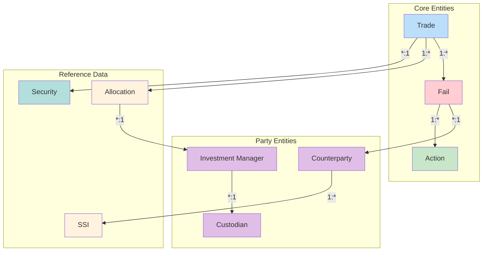

# Entity Relationships

Data model for the fail monitoring system. Defines core entities, relationships, and data quality requirements.

---

## Entity Relationship Diagram



---

## Core Entities

### Fail
The central entity representing a settlement failure.

| Field | Type | Description | Reference |
|-------|------|-------------|-----------|
| fail_id | UUID | Unique identifier | |
| trade_id | UUID | Link to originating trade | Trade |
| cusip | VARCHAR(9) | Security identifier | Security |
| quantity | INTEGER | Number of shares | |
| market_value | DECIMAL | Current market value | |
| counterparty_id | UUID | Other party to the trade | Counterparty |
| fail_type | ENUM | FTD or FTR | [[fail-to-deliver]], [[fail-to-receive]] |
| fail_subtype | ENUM | SHORT_SALE, LONG_SALE, etc. | [[reg-sho-rule-204]] |
| settlement_date | DATE | Original expected settlement | |
| age_days | INTEGER | Days since settlement_date | [[prioritization-logic]] |
| status | ENUM | PENDING, OPEN, ESCALATED, etc. | [[fail-lifecycle]] |
| is_threshold | BOOLEAN | On [[threshold-securities\|threshold list]] | |
| reg_sho_deadline | TIMESTAMP | Close-out deadline | [[close-out-matrix]] |
| priority_score | INTEGER | Calculated priority (0-100) | [[prioritization-logic]] |
| inventory_coverage_pct | DECIMAL | % covered by box/loan/pending | [[priority-score-formula]] |
| concentration_modifier | DECIMAL | 1.0-1.5 multiplier | [[priority-score-formula]] |
| created_at | TIMESTAMP | When fail was created | |
| updated_at | TIMESTAMP | Last modification | |

### Trade
The original transaction that resulted in a fail.

| Field | Type | Description | Reference |
|-------|------|-------------|-----------|
| trade_id | UUID | Unique identifier | |
| execution_date | DATE | When trade was executed | |
| settlement_date | DATE | Expected settlement date | |
| cusip | VARCHAR(9) | Security identifier | Security |
| quantity | INTEGER | Number of shares | |
| price | DECIMAL | Execution price | |
| side | ENUM | BUY or SELL | |
| trade_type | ENUM | CNS, BILATERAL, EX_CLEARING | [[settlement-lifecycle]] |
| cns_eligible | BOOLEAN | CNS eligibility flag | [[cns-cp-eligibility]] |
| is_institutional | BOOLEAN | Institutional (IM) trade | [[im-data-quality]] |
| affirmation_status | ENUM | PENDING, AFFIRMED, etc. | |
| affirmation_time | TIMESTAMP | When affirmed | [[t1-critical-deadlines]] |

### Action
Audit trail of actions taken on a fail.

| Field | Type | Description | Reference |
|-------|------|-------------|-----------|
| action_id | UUID | Unique identifier | |
| fail_id | UUID | Link to fail | Fail |
| action_type | ENUM | ESCALATE, OFFSET, BUYIN, etc. | [[fail-lifecycle]] |
| action_by | VARCHAR | User/system identifier | |
| notes | TEXT | Action details | |
| created_at | TIMESTAMP | When action taken | |

---

## Party Entities

### Counterparty
External party involved in the trade. See [[cns-cp-eligibility]] for eligibility rules.

| Field | Type | Description | Reference |
|-------|------|-------------|-----------|
| counterparty_id | UUID | Unique identifier | |
| legal_name | VARCHAR | Legal entity name | |
| dtc_participant_number | VARCHAR(4) | DTC account | |
| nscc_participant_id | VARCHAR(5) | NSCC member number | [[cns-cp-eligibility]] |
| lei | VARCHAR(20) | Legal Entity Identifier | |
| bic_code | VARCHAR(11) | SWIFT BIC | |
| cns_eligible | BOOLEAN | CNS participation | [[cns-cp-eligibility]] |
| membership_status | ENUM | ACTIVE, SUSPENDED, CEASED | |
| risk_rating | VARCHAR | Internal risk score | |
| fail_history_score | INTEGER | Historical fail rate | [[prioritization-logic]] |
| fail_count_15d | INTEGER | Fails in last 15 days | [[priority-score-formula]] |
| trade_count_15d | INTEGER | Trades in last 15 days | [[priority-score-formula]] |
| contact_email | VARCHAR | Operations contact | |
| is_active | BOOLEAN | Currently active | |

### Investment Manager
Buy-side institution managing accounts. See [[im-data-quality]] for data quality.

| Field | Type | Description | Reference |
|-------|------|-------------|-----------|
| im_id | UUID | Unique identifier | |
| im_name | VARCHAR | Legal name | |
| im_type | ENUM | PENSION, MUTUAL_FUND, etc. | |
| primary_custodian_id | UUID | Default custodian | Custodian |
| contact_email | VARCHAR | Operations contact | |
| is_active | BOOLEAN | Currently active | |

### Custodian
Agent bank providing custody services.

| Field | Type | Description | Reference |
|-------|------|-------------|-----------|
| custodian_id | UUID | Unique identifier | |
| custodian_name | VARCHAR | Legal name | |
| dtc_participant_number | VARCHAR(4) | DTC account | |
| bic_code | VARCHAR(11) | SWIFT BIC | |
| is_active | BOOLEAN | Currently active | |

---

## Reference Data Entities

### Security
Security master data.

| Field | Type | Description | Reference |
|-------|------|-------------|-----------|
| cusip | VARCHAR(9) | Primary key | |
| ticker | VARCHAR | Trading symbol | |
| security_name | VARCHAR | Issue name | |
| security_type | ENUM | EQUITY, BOND, etc. | |
| is_cns_eligible | BOOLEAN | CNS eligible | [[cns-cp-eligibility]] |
| is_threshold | BOOLEAN | On threshold list | [[threshold-securities]] |
| threshold_date | DATE | When added to threshold | |
| is_htb | BOOLEAN | Hard-to-borrow | [[penalty-box]] |
| borrow_rate | DECIMAL | Current borrow rate | |
| fail_qty_15d | INTEGER | Fail qty in last 15 days | [[priority-score-formula]] |
| adv_15d | DECIMAL | 15-day avg daily volume | [[priority-score-formula]] |

### SSI (Standing Settlement Instructions)
Settlement instructions by counterparty. See [[ssi-mismatches]] for data quality.

| Field | Type | Description | Reference |
|-------|------|-------------|-----------|
| ssi_id | UUID | Unique identifier | |
| counterparty_id | UUID | Link to counterparty | Counterparty |
| account_type | ENUM | DTC, SWIFT, etc. | [[ssi-mismatches]] |
| dtc_participant_number | VARCHAR(4) | DTC account | |
| sub_account | VARCHAR | Internal routing | |
| bic_code | VARCHAR(11) | SWIFT BIC | |
| agent_bank_id | UUID | Custodian reference | Custodian |
| effective_date | DATE | When effective | |
| expiry_date | DATE | When expires | |
| is_active | BOOLEAN | Currently active | |
| last_validated | TIMESTAMP | Last validation date | |

### Allocation
Block trade allocation to IM accounts. See [[im-data-quality]] for data quality.

| Field | Type | Description | Reference |
|-------|------|-------------|-----------|
| allocation_id | UUID | Unique identifier | |
| trade_id | UUID | Block trade | Trade |
| im_account_id | UUID | IM account | IMAccount |
| quantity | INTEGER | Allocated shares | |
| price | DECIMAL | Allocation price | |
| commission | DECIMAL | Per-allocation fees | |
| allocation_time | TIMESTAMP | When allocated | |
| affirmed_time | TIMESTAMP | When affirmed | |
| affirmation_status | ENUM | PENDING, AFFIRMED, etc. | [[im-data-quality]] |

---

## Relationship Summary

```
┌─────────────┐       ┌───────────┐       ┌──────────────┐
│    Trade    │ 1───* │   Fail    │ *───1 │ Counterparty │
└──────┬──────┘       └─────┬─────┘       └──────┬───────┘
       │                    │                    │
       │ 1                  │ 1                  │ 1
       │ *                  │ *                  │ *
       ▼                    ▼                    ▼
┌─────────────┐       ┌───────────┐       ┌──────────────┐
│ Allocation  │       │  Action   │       │     SSI      │
└──────┬──────┘       └───────────┘       └──────────────┘
       │
       │ *
       │ 1
       ▼
┌─────────────┐       ┌───────────┐
│  IM Account │ *───1 │ Custodian │
└──────┬──────┘       └───────────┘
       │
       │ *
       │ 1
       ▼
┌─────────────┐
│ Inv Manager │
└─────────────┘
```

| Relationship | Cardinality | Description |
|--------------|-------------|-------------|
| Trade → Fail | 1:N | One trade can have multiple fails (partial) |
| Fail → Counterparty | N:1 | Each fail has one counterparty |
| Fail → Action | 1:N | Each fail has multiple actions (audit) |
| Trade → Allocation | 1:N | Block trade has multiple allocations |
| Allocation → IM Account | N:1 | Allocations belong to IM accounts |
| IM Account → Custodian | N:1 | Accounts custody at one custodian |
| Counterparty → SSI | 1:N | Each CP has multiple SSIs |

---

## Indexes

### Fail Indexes
| Index | Fields | Purpose |
|-------|--------|---------|
| idx_fail_cusip | cusip | Security-based lookups |
| idx_fail_status | status | Status filtering |
| idx_fail_counterparty | counterparty_id | CP analysis |
| idx_fail_settlement_date | settlement_date | Aging calculations |
| idx_fail_priority | priority_score DESC | Priority queue |
| idx_fail_reg_sho | reg_sho_deadline | Regulatory monitoring |

### Trade Indexes
| Index | Fields | Purpose |
|-------|--------|---------|
| idx_trade_settlement | settlement_date | Settlement lookups |
| idx_trade_affirmation | affirmation_status, is_institutional | LMIT monitoring |

### SSI Indexes
| Index | Fields | Purpose |
|-------|--------|---------|
| idx_ssi_counterparty | counterparty_id, is_active | SSI lookups |
| idx_ssi_dtc | dtc_participant_number | DTC routing |

---

## Priority Scoring Data Sources

The [[priority-score-formula]] requires data from multiple systems:

### Inventory Sources (for Coverage Modifier)
| Source | System | Refresh | Description |
|--------|--------|---------|-------------|
| Box | Position system | Real-time | Settled long positions |
| Stock Loan | Loan system | Real-time | Active borrows |
| Pending Receives | Settlement | Intraday | Expected inbound (T+1) |

### Historical Aggregates (15-Day Rolling)
| Metric | Calculation | Source |
|--------|-------------|--------|
| CP fail rate | `fail_count / trade_count` | Trade history |
| Security fail concentration | `fail_qty / ADV` | Fail + volume data |

---

## Data Quality Rules

See [[ssi-mismatches]], [[cns-cp-eligibility]], [[im-data-quality]] for detailed rules.

| Entity | Rule | Validation |
|--------|------|------------|
| Fail | CUSIP valid | 9-character, exists in master |
| Fail | Quantity positive | > 0 |
| Fail | Settlement not future | <= today |
| Trade | Affirmation time | Before 9:00 PM T for institutional |
| Counterparty | DTC number valid | Exists in DTC directory |
| SSI | Agent bank valid | Exists in custodian master |
| Allocation | Sum = block | Allocations sum to trade quantity |

---

## Related
- [[data-sources]] - Data feeds
- [[fail-lifecycle]] - State machine
- [[ssi-mismatches]] - SSI data quality
- [[cns-cp-eligibility]] - CP eligibility data
- [[im-data-quality]] - IM data quality
- [[prioritization-logic]] - Scoring uses entity data
- [[priority-score-formula]] - Calculation details
