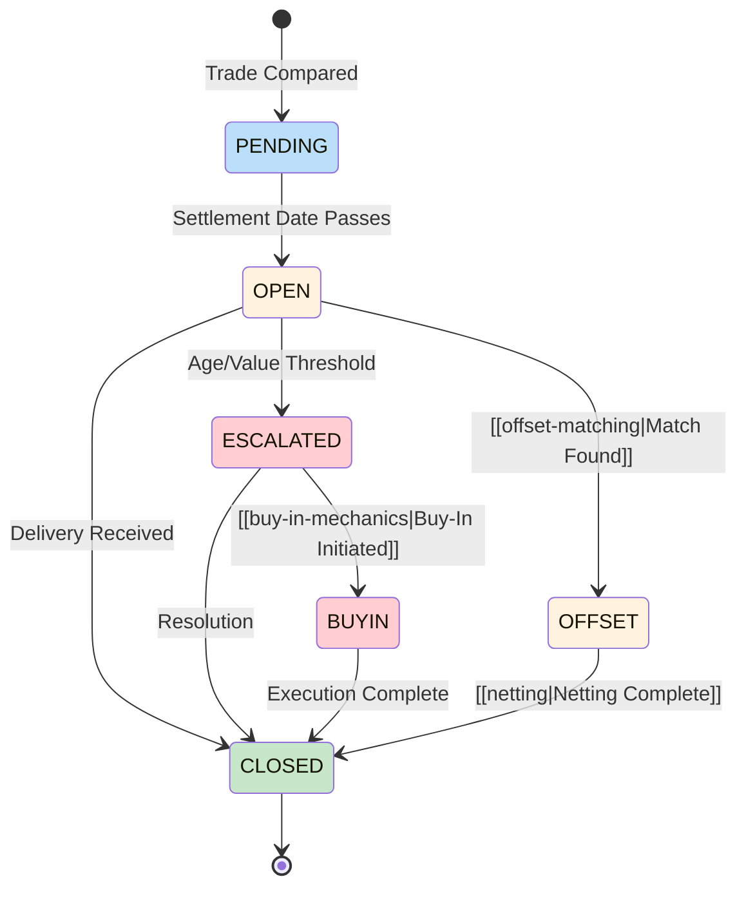

# Fail Lifecycle

State machine documenting fail transitions from creation to resolution.

---

## State Diagram

---

## State Definitions

| State | Description | Exit Criteria |
|-------|-------------|---------------|
| PENDING | Trade has not yet reached settlement date | Settlement date arrives |
| OPEN | Active fail, settlement did not occur | Resolution or escalation |
| ESCALATED | Requires manual intervention | Resolution |
| BUYIN | [[buy-in-mechanics\|Buy-in]] in progress | Execution |
| OFFSET | Matched for [[offset-matching\|netting]] | Netting completion |
| CLOSED | Resolved | N/A (terminal) |

---

## Aging Integration

See [[settlement-lifecycle]] for 8-node decision tree context.

| Age | State | Actions | References |
|-----|-------|---------|------------|
| Day 1-3 | OPEN | Standard monitoring | [[prioritization-logic]] |
| Day 4-9 | OPEN→ESCALATED | Increased priority | [[cns-fails-charge]] begins |
| Day 10+ | ESCALATED | [[escalation-paths]] required | [[aged-fail-deductions]] |
| Day 13+ | ESCALATED | [[threshold-securities\|Mandatory close-out]] | [[reg-sho-rule-204]] |

---

## Transition Triggers

| Transition | Trigger | System |
|------------|---------|--------|
| PENDING → OPEN | 3:00 PM ET cutoff | [[day-cycle]] |
| OPEN → ESCALATED | [[prioritization-logic]] threshold | [[new-fail-triage]] |
| OPEN → OFFSET | [[offset-matching\|Match identified]] | Netting engine |
| ESCALATED → BUYIN | Buy-in decision | [[buy-in-mechanics]] |
| ESCALATED → CLOSED | Delivery received | Settlement |
| OFFSET → CLOSED | [[netting\|Netting cycle]] completes | [[cns-system]] |

---

## Financial Impact by State

| State | [[cns-fails-charge\|CNS Charge]] | [[aged-fail-deductions\|Capital]] |
|-------|-------------|---------|
| PENDING | None | None |
| OPEN (1-4d) | 5% | None |
| OPEN (5-10d) | 15% | Begins S+5 |
| ESCALATED | 15-20% | 15-25% |
| BUYIN | 20-100% | 25-100% |

---

## Related
- [[settlement-lifecycle]] - 8-node decision tree
- [[fail-to-deliver]] - FTD specifics
- [[fail-to-receive]] - FTR specifics
- [[offset-matching]] - OFFSET state details
- [[escalation-paths]] - ESCALATED procedures
- [[prioritization-logic]] - Transition triggers
