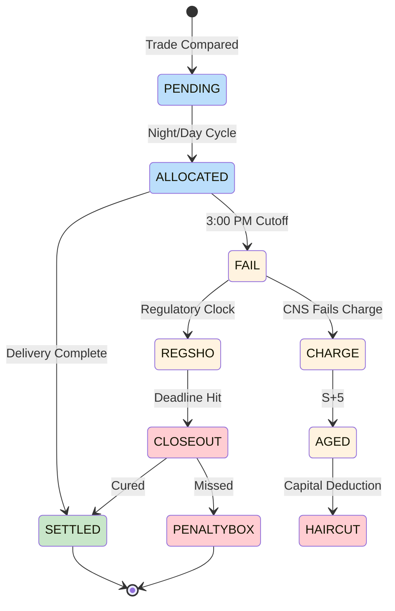

# Fail-to-Deliver (FTD)

Seller's failure to deliver securities on settlement date. Creates obligation to counterparty and triggers regulatory/financial consequences.

---

## FTD Lifecycle



---

## FTD Types

| Type | Source | Reg SHO Deadline |
|------|--------|------------------|
| Short Sale FTD | Short position without locate | S+1 market open |
| Long Sale FTD | Inventory shortfall | S+3 market open |
| Market Maker FTD | Market making activity | S+3 (extended) |
| Threshold FTD | [[threshold-securities]] position | S+13 mandatory |

---

## Causes

| Category | Cause | Frequency |
|----------|-------|-----------|
| Inventory | Securities not in position | High |
| Chain | Upstream [[fail-to-receive\|FTR]] blocking delivery | High |
| Operational | Processing error, late affirmation | Medium |
| Recall | [[recalls\|Stock loan recall]] not received | Medium |
| Corporate Action | Pending reorg, dividend | Low |
| Counterparty | Counterparty system issue | Low |

---

## Financial Impact

### CNS Fails Charge
See [[cns-fails-charge]] for calculation.

| Age | Rate | Example ($1M) |
|-----|------|---------------|
| Day 1-4 | 5% | $50,000 |
| Day 5-10 | 15% | $150,000 |
| Day 11-20 | 20% | $200,000 |
| Day 21+ | 100% | $1,000,000 |

### Rule 15c3-1 Haircuts
See [[aged-fail-deductions]] for schedule.

| Age | Deduction |
|-----|-----------|
| S+5 | Begins |
| S+7 | 15% |
| S+14 | 25% |
| S+21 | 100% |

### Operational Costs
| Cost Type | Range |
|-----------|-------|
| STP delivery | $0.37 |
| Failed delivery | $30-50 |
| Buy-in execution | Variable |
| Penalty Box (HTB) | 10-100%+ APR |

---

## Resolution Paths

| Path | Mechanism | Priority |
|------|-----------|----------|
| Natural settlement | Inventory arrives | Standard |
| [[offset-matching\|Offset]] | Match with incoming [[fail-to-receive\|FTR]] | Standard |
| [[stock-borrow-program\|SBP]] | NSCC borrow | Elevated |
| [[partial-settlement]] | Deliver available shares | Standard |
| [[buy-in-mechanics\|Buy-In]] | Forced purchase | High |
| Market purchase | Direct acquisition | Regulatory |

---

## Monitoring Triggers

| Trigger | Action | Page |
|---------|--------|------|
| Age > 3 days | Increase priority | [[prioritization-logic]] |
| Age > 10 days | Auto-escalate | [[escalation-paths]] |
| Threshold security | Critical priority | [[threshold-securities]] |
| Approaching S+1/S+3 | Reg SHO alert | [[reg-sho-rule-204]] |
| Value > $1M | High value flag | [[new-fail-triage]] |

---

## Data Model

```yaml
webapp_entity: "Fail"
webapp_fields:
  - name: fail_type
    type: ENUM
    values: ["FTD", "FTR"]
  - name: fail_subtype
    type: ENUM
    values: ["SHORT_SALE", "LONG_SALE", "MARKET_MAKER", "THRESHOLD"]
  - name: security_id
    type: VARCHAR(9)
    description: "CUSIP"
  - name: quantity
    type: INTEGER
  - name: market_value
    type: DECIMAL
  - name: settlement_date
    type: DATE
  - name: age_days
    type: INTEGER
    calculation: "CURRENT_DATE - settlement_date"
  - name: reg_sho_deadline
    type: TIMESTAMP
  - name: is_threshold
    type: BOOLEAN
  - name: counterparty_id
    type: VARCHAR
```

---

## Related
- [[fail-to-receive]] - Buyer-side fail
- [[fail-lifecycle]] - State machine
- [[offset-matching]] - FTD/FTR pairing
- [[cns-fails-charge]] - Cost calculation
- [[reg-sho-rule-204]] - Close-out deadlines
- [[prioritization-logic]] - Scoring factors
- [[settlement-lifecycle]] - Node 5 (Fail Established)
