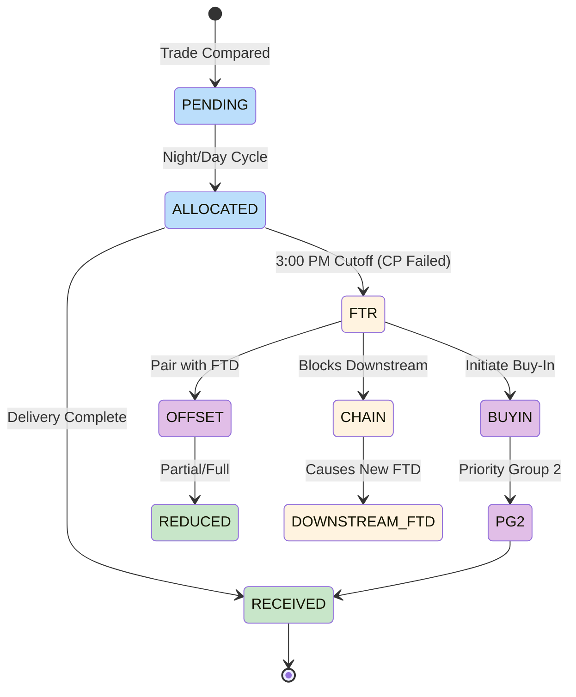
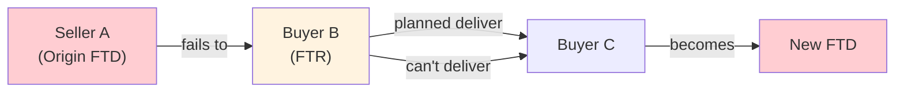

# Fail-to-Receive (FTR)

Buyer's failure to receive securities on settlement date due to counterparty non-delivery. Creates downstream chain effects and balance sheet impacts.

---

## FTR Characteristics

| Aspect | FTR | [[fail-to-deliver\|FTD]] |
|--------|-----|-----|
| Party | Buyer | Seller |
| Cause | Counterparty failed | Own inventory issue |
| Control | Limited (external) | Direct (internal) |
| Reg SHO | No close-out obligation | Close-out required |
| Chain Impact | Blocks downstream delivers | Root cause |

---

## FTR Lifecycle



---

## Chain Effect

> [!warning] Fail Chains
> FTRs create chain failures when expected inventory is needed for downstream deliveries.



| Position | Impact |
|----------|--------|
| Buyer B (FTR) | Waiting on counterparty |
| Buyer B → C | Cannot deliver (chain) |
| Buyer C | Secondary FTD created |

---

## Financial Impact

### Balance Sheet
| Treatment | CNS | Bilateral |
|-----------|-----|-----------|
| Booking | Net position | Gross receivable |
| Exposure | CCP guaranteed | Direct counterparty |
| Mark-to-market | Daily | [[recaps\|RECAPS]] cycle |

### Opportunity Cost
| Factor | Impact |
|--------|--------|
| Blocked sales | Lost trading opportunity |
| Margin | Capital tied up |
| Settlement efficiency | Downstream failures |

### No Direct Fails Charge
Unlike [[fail-to-deliver\|FTD]], FTRs don't directly trigger [[cns-fails-charge]] - the delivering party bears that cost.

---

## Resolution Options

| Option | Mechanism | Timing |
|--------|-----------|--------|
| Wait | Counterparty delivers | Passive |
| [[offset-matching\|Offset]] | Match with outbound FTD | Standard |
| [[buy-in-mechanics\|Buy-In]] | Force counterparty delivery | Active |
| Market purchase | Buy elsewhere | Alternative |

### Buy-In Process
See [[buy-in-mechanics]] for details.

| Step | Action |
|------|--------|
| 1 | Submit Buy-In Intent |
| 2 | Position elevated to [[priority-groups\|Priority Group 2]] |
| 3 | Retransmittal Notice to oldest short |
| 4 | Market execution if unresolved |

---

## Monitoring Considerations

| Factor | FTR Specific |
|--------|--------------|
| Priority scoring | Lower weight (external cause) |
| Chain analysis | Track downstream impact |
| Buy-in timing | Consider cost vs. wait |
| Counterparty history | [[prioritization-logic\|CP Factor]] |

### Escalation Triggers
| Trigger | Action |
|---------|--------|
| Age > 5 days | Review for buy-in |
| Blocking high-value deliver | Escalate |
| Pattern from same CP | Flag counterparty |
| Affecting customer settlement | Immediate attention |

---

## Offset Matching

See [[offset-matching]] for algorithm.

```
FTR in CUSIP X + FTD in CUSIP X → Net reduction
```

| Scenario | Result |
|----------|--------|
| FTR qty ≥ FTD qty | Full FTD offset |
| FTR qty < FTD qty | Partial FTD offset |
| Multiple FTRs/FTDs | FIFO matching |

---

## Data Model

```yaml
webapp_entity: "Fail"
webapp_fields:
  - name: fail_type
    type: ENUM
    values: ["FTD", "FTR"]
  - name: security_id
    type: VARCHAR(9)
  - name: quantity
    type: INTEGER
  - name: market_value
    type: DECIMAL
  - name: settlement_date
    type: DATE
  - name: age_days
    type: INTEGER
  - name: counterparty_id
    type: VARCHAR
  - name: is_blocking_downstream
    type: BOOLEAN
    description: "FTR blocking outbound delivery"
  - name: downstream_fail_id
    type: INTEGER
    description: "Link to caused FTD"
  - name: buyin_initiated
    type: BOOLEAN
```

---

## Related
- [[fail-to-deliver]] - Seller-side fail
- [[fail-lifecycle]] - State machine
- [[offset-matching]] - FTD/FTR pairing
- [[buy-in-mechanics]] - Resolution via buy-in
- [[prioritization-logic]] - Scoring factors
- [[settlement-lifecycle]] - Overall flow
