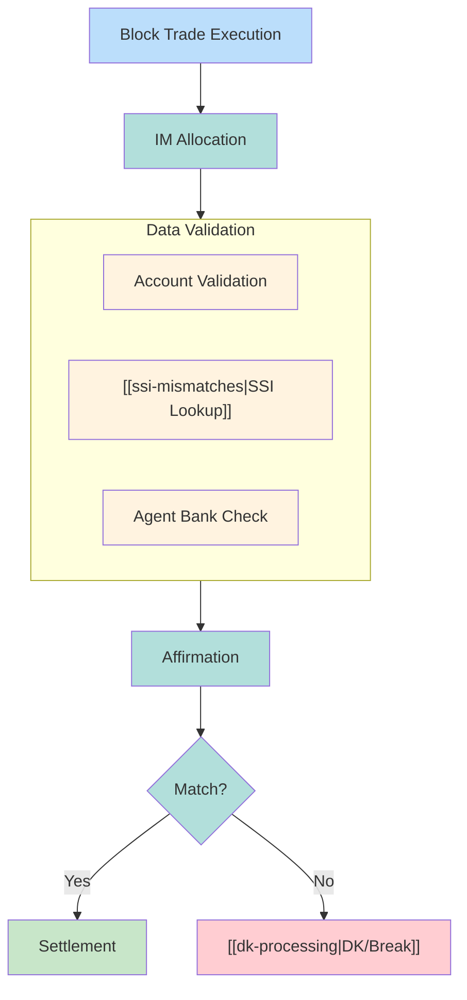
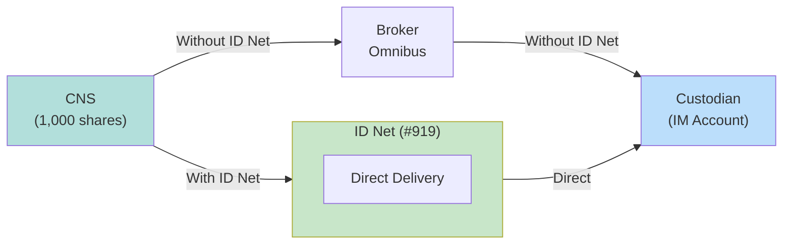

# Investment Manager Data Quality

Data quality issues with Investment Manager (IM) accounts, allocations, and affirmations are a leading cause of institutional trade failures. T+1 settlement demands near-perfect data.

---

## IM Data Flow



---

## Data Quality Categories

### 1. Account Reference Data
| Field | Description | Quality Issue |
|-------|-------------|---------------|
| IM Account ID | Unique account identifier | Stale or missing |
| Account Name | Legal account name | Name mismatch |
| Account Type | Pension, mutual fund, etc. | Wrong classification |
| Tax Status | Tax treatment code | Incorrect withholding |

### 2. Allocation Data
| Field | Description | Quality Issue |
|-------|-------------|---------------|
| Allocation quantity | Shares per account | Quantity mismatch |
| Allocation price | Execution price | Price discrepancy |
| Pro-rata split | Distribution method | Incorrect split |
| Fees/commissions | Per-account charges | Fee allocation error |

### 3. Settlement Instructions
| Field | Description | Quality Issue |
|-------|-------------|---------------|
| DTC account | Custodian's DTC number | Wrong account |
| Agent bank | Custodian identifier | Agent mismatch |
| Sub-account | Internal routing | Missing routing |

See [[ssi-mismatches]] for detailed SSI issues.

---

## Common IM Data Errors

### Allocation Errors
| Error | Cause | Impact |
|-------|-------|--------|
| Quantity mismatch | Execution vs allocation qty | Affirmation failure |
| Price variance | Block vs allocation price | Comparison break |
| Missing allocation | Late or failed transmission | Trade unaffirmed |
| Duplicate allocation | System retry | Over-allocation |

### Account Errors
| Error | Cause | Impact |
|-------|-------|--------|
| Unknown account | New account not onboarded | [[dk-processing\|DK]] rejection |
| Closed account | Stale account status | Settlement fails |
| Wrong custodian | SSI mismatch | Delivery fails |
| Restricted account | Compliance flag | Trade blocked |

### Affirmation Errors
| Error | Cause | Impact |
|-------|-------|--------|
| Late affirmation | Missed 9:00 PM cutoff | [[night-cycle]] exclusion |
| Mismatch details | Data discrepancy | Affirmation rejected |
| No affirmation | IM doesn't respond | Bilateral settlement risk |

---

## T+1 Affirmation Timeline

> [!danger] Critical: 9:00 PM Cutoff
> Institutional trades must be affirmed by **9:00 PM ET on Trade Date (T)** to enter the CNS Night Cycle.

```mermaid
gantt
    title IM Affirmation Timeline (T+1)
    dateFormat HH:mm
    axisFormat %H:%M

    section Trade Date (T)
    Trade Execution        :09:30, 6h30m
    IM Allocation Window   :16:00, 3h
    Affirmation Deadline   :crit, 21:00, 15m

    section Settlement (S)
    Night Cycle            :23:30, 2h30m
    Day Cycle              :06:00, 9h
```



| Deadline | T+2 Era | T+1 Era |
|----------|---------|---------|
| Affirmation | 9:00 PM T+1 | 9:00 PM T |
| Available time | ~24 hours | ~5 hours |
| Manual fix window | Next morning | Same evening |

---

## Late Matched Institutional Trades (LMIT)

Trades affirmed after the 9:00 PM cutoff require special handling:

| Aspect | LMIT Impact |
|--------|-------------|
| Night Cycle | Excluded |
| Settlement | [[day-cycle]] only |
| Risk | Higher fail probability |
| IMS | Active authorization required |

See [[ims-profiles]] for Active vs Passive authorization.

---

## ID Net Integration

For broker-custodian deliveries, **ID Net** service provides efficiency:



| Aspect | Without ID Net | With ID Net |
|--------|----------------|-------------|
| Hops | 2 (CNS→Broker→Custodian) | 1 (CNS→Custodian via #919) |
| Broker inventory | Used | Bypassed |
| Efficiency | Lower | Higher |
| Fail risk | Higher | Lower |

---

## Data Quality Metrics

| Metric | Target | Impact |
|--------|--------|--------|
| Allocation accuracy | > 99.5% | Fewer affirmation breaks |
| Affirmation rate (same-day) | > 98% | Higher Night Cycle inclusion |
| First-time match rate | > 95% | Higher STP |
| Account data currency | < 30 days | Fewer stale data issues |
| SSI coverage | > 99% | Fewer missing SSI breaks |

---

## Remediation Workflow

### Immediate Actions
| Step | Action | System |
|------|--------|--------|
| 1 | Identify break type | Exception Manager |
| 2 | Query allocation system | OMS/EMS |
| 3 | Compare broker vs IM data | Matching utility |
| 4 | Contact IM/custodian | Middle Office |
| 5 | Submit corrected data | Re-affirm |

### Escalation Triggers
| Trigger | Action |
|---------|--------|
| < 1 hour to cutoff | Escalate to senior ops |
| High-value trade | Notify trading desk |
| Repeat IM issues | Flag IM relationship |
| Custodian issue | Escalate to custodian ops |

---

## Data Model

```yaml
webapp_entity: "IMAccount"
webapp_fields:
  - name: im_account_id
    type: UUID
  - name: im_id
    type: UUID
    ref: InvestmentManager
  - name: account_name
    type: VARCHAR
  - name: account_type
    type: ENUM
    values: ["PENSION", "MUTUAL_FUND", "HEDGE_FUND", "INSURANCE", "OTHER"]
  - name: custodian_id
    type: UUID
    ref: Custodian
  - name: dtc_account
    type: VARCHAR(4)
  - name: sub_account
    type: VARCHAR
  - name: tax_status
    type: VARCHAR
  - name: is_active
    type: BOOLEAN
  - name: last_validated
    type: TIMESTAMP
```

```yaml
webapp_entity: "Allocation"
webapp_fields:
  - name: allocation_id
    type: UUID
  - name: block_trade_id
    type: UUID
    ref: Trade
  - name: im_account_id
    type: UUID
    ref: IMAccount
  - name: quantity
    type: INTEGER
  - name: price
    type: DECIMAL
  - name: commission
    type: DECIMAL
  - name: allocation_time
    type: TIMESTAMP
  - name: affirmed_time
    type: TIMESTAMP
  - name: affirmation_status
    type: ENUM
    values: ["PENDING", "AFFIRMED", "REJECTED", "CANCELLED"]
```

---

## Integration Points

| System | Integration |
|--------|-------------|
| [[data-sources]] | IM account master, allocation feeds |
| [[ssi-mismatches]] | SSI validation |
| [[cns-cp-eligibility]] | Custodian eligibility |
| [[ims-profiles]] | LMIT handling |
| [[settlement-lifecycle]] | Node 1 affirmation |
| [[t1-critical-deadlines]] | Affirmation cutoff |

---

## Related
- [[ssi-mismatches]] - Settlement instruction issues
- [[cns-cp-eligibility]] - Counterparty eligibility
- [[dk-processing]] - DK resolution
- [[ims-profiles]] - IMS authorization modes
- [[t1-critical-deadlines]] - 9:00 PM affirmation deadline
- [[entity-relationships]] - Data model
- [[night-cycle]] - Night Cycle inclusion criteria
