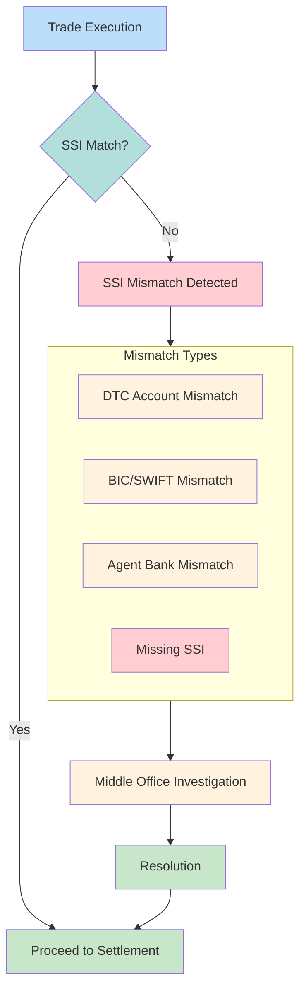

# SSI Mismatches

Standing Settlement Instructions (SSI) mismatches occur when delivery instructions don't align between trading parties. A leading cause of DK (Don't Know) rejections and settlement failures.

---

## SSI Mismatch Flow



---

## SSI Components

### DTC Settlement Instructions
| Field | Description | Validation |
|-------|-------------|------------|
| DTC Participant Number | 4-digit DTC account | Must exist in DTC directory |
| Sub-account | Optional internal routing | Alphanumeric |
| Institution ID | Investment manager identifier | Must match IM master |
| Agent Bank | Custodian identifier | Must be valid custodian |

### SWIFT/BIC Instructions (Cross-border)
| Field | Description | Format |
|-------|-------------|--------|
| BIC Code | Bank Identifier Code | 8 or 11 characters |
| Account Number | Beneficiary account | Variable |
| Correspondent BIC | Intermediary bank | 8 or 11 characters |

---

## Mismatch Categories

### 1. DTC Account Mismatches
| Cause | Impact | Resolution |
|-------|--------|------------|
| Wrong DTC number | Delivery fails | Correct SSI, resend |
| Obsolete account | Rejected by DTC | Update SSI database |
| Sub-account routing | Internal fail | Update routing table |

### 2. Agent Bank Mismatches
| Cause | Impact | Resolution |
|-------|--------|------------|
| Wrong custodian | Cannot affirm | Contact IM for correct agent |
| Custodian change | Trade hangs | Update SSI, re-affirm |
| Multiple custodians | Routing confusion | Specify account-level SSI |

### 3. BIC/SWIFT Mismatches
| Cause | Impact | Resolution |
|-------|--------|------------|
| Invalid BIC | Payment rejected | Validate against SWIFT directory |
| Wrong correspondent | Payment delayed | Update payment chain |
| Stale instructions | Fails | Periodic SSI refresh |

### 4. Missing SSI
| Scenario | Impact | Resolution |
|---------|--------|------------|
| New counterparty | Cannot settle | Collect SSI before trade |
| New security type | No instructions | Add asset-specific SSI |
| Account not set up | [[dk-processing\|DK]] rejection | Onboard account properly |

---

## SSI Mismatch Detection

### Pre-Trade (Preventive)
| Check | Timing | System |
|-------|--------|--------|
| SSI existence | Order entry | OMS |
| Account validation | Pre-allocation | Middleware |
| DTC number check | Pre-affirmation | Matching utility |

### Post-Trade (Detective)
| Check | Timing | System |
|-------|--------|--------|
| Affirmation failure | T+0 | CTM/ALERT |
| DK reason code 41 | Settlement | [[dk-processing]] |
| Delivery rejection | 3:00 PM cutoff | [[ims-profiles\|IMS]] |

---

## T+1 Impact

> [!warning] Compressed Timeline
> T+1 settlement leaves minimal time for SSI resolution. Automation critical.

| T+2 Era | T+1 Era |
|---------|---------|
| Next-day SSI fix acceptable | Same-day fix required |
| Manual investigation possible | Automation mandatory |
| 9:00 PM affirmation (T+1) | 9:00 PM affirmation (T) |

### Critical Deadlines
| Deadline | Impact |
|----------|--------|
| 9:00 PM T | Affirmation cutoff - SSI must be resolved |
| 10:45 PM T | CNS exemption cutoff |
| 3:00 PM S | Settlement cutoff - fail established |

---

## Resolution Workflow

### Immediate Actions
| Step | Action | Owner |
|------|--------|-------|
| 1 | Identify mismatch type from [[dtc-reason-codes\|reason code]] | Operations |
| 2 | Query SSI database | Operations |
| 3 | Contact counterparty | Middle Office |
| 4 | Update SSI | Operations |
| 5 | Reaffirm trade | Operations |

### Escalation
| Trigger | Action |
|---------|--------|
| > 2 hours unresolved | Escalate to senior ops |
| Approaching affirmation cutoff | Escalate to trading desk |
| Repeat SSI issues with same CP | Flag counterparty |

---

## SSI Data Quality Metrics

| Metric | Target | Impact |
|--------|--------|--------|
| SSI coverage rate | > 99% | Fewer missing SSI issues |
| SSI accuracy rate | > 99.5% | Fewer mismatch fails |
| SSI freshness | < 90 days | Fewer stale instruction issues |
| First-time match rate | > 95% | Higher STP rate |

---

## Data Model

```yaml
webapp_entity: "SSI"
webapp_fields:
  - name: ssi_id
    type: UUID
  - name: counterparty_id
    type: UUID
    ref: Counterparty
  - name: account_type
    type: ENUM
    values: ["DTC", "SWIFT", "EUROCLEAR", "CLEARSTREAM"]
  - name: dtc_participant_number
    type: VARCHAR(4)
    description: "DTC account number"
  - name: sub_account
    type: VARCHAR
    description: "Internal routing"
  - name: bic_code
    type: VARCHAR(11)
    description: "SWIFT BIC for cross-border"
  - name: agent_bank_id
    type: UUID
    ref: Custodian
  - name: effective_date
    type: DATE
  - name: expiry_date
    type: DATE
  - name: is_active
    type: BOOLEAN
  - name: last_validated
    type: TIMESTAMP
```

---

## Integration Points

| System | Integration |
|--------|-------------|
| [[data-sources]] | SSI feed ingestion |
| [[dk-processing]] | DK reason code 41 |
| [[entity-relationships]] | Counterparty linkage |
| [[new-fail-triage]] | SSI-related fail flagging |

---

## Related
- [[dk-processing]] - DK resolution workflow
- [[dtc-reason-codes]] - Error codes
- [[cns-cp-eligibility]] - CP requirements
- [[im-data-quality]] - IM account data
- [[entity-relationships]] - Data model
- [[t1-critical-deadlines]] - Cutoff times
