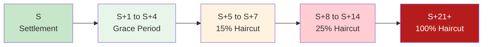

# Aged Fail Deductions

SEC Rule 15c3-1 capital deductions for aged settlement failures. Can force business cessation.

---

## Deduction Schedule (Equities)

| Age | Deduction % | Cumulative Impact |
|-----|-------------|-------------------|
| S+5 | Begins | Monitoring |
| S+7 | 15% | Warning |
| S+14 | 25% | Elevated |
| S+21 | 100% | Full capital charge |

---

## Timeline Visualization



---

## Calculation

```
Capital Deduction = Fail Market Value × Haircut %
```

| Example ($1M fail) | Haircut | Deduction |
|--------------------|---------|-----------|
| Day 7 | 15% | $150,000 |
| Day 14 | 25% | $250,000 |
| Day 21 | 100% | $1,000,000 |

---

## Business Impact

> [!danger] Capital at Risk
> Aged fails directly reduce excess net capital. Sufficient aged fails can trigger regulatory thresholds.

| Threshold | Consequence |
|-----------|-------------|
| Early warning | Regulatory notification |
| Below minimum | Trading restrictions |
| Critical | Business cessation |

---

## Municipal Securities

| Security Type | 100% Haircut |
|---------------|--------------|
| Equities | S+21 |
| Municipals | S+21 (same) |

---

## Interaction with CNS Fails Charge

| Cost | Source |
|------|--------|
| [[cns-fails-charge]] | NSCC penalty |
| Aged Fail Deduction | Capital charge |
| Total Impact | Both apply |

---

## Related
- [[reg-sho-rule-204]] - Regulatory deadlines
- [[cns-fails-charge]] - NSCC penalty
- [[fail-to-deliver]] - FTD lifecycle
- [[prioritization-logic]] - Age factor in scoring
- [[escalation-paths]] - Escalation for aged fails
