# Buy-In Mechanics

Forced purchase to close fail positions. Two paths: CNS (NSCC Rule 11) and Bilateral (FINRA Rule 11810).

---

## Comparison

```mermaid
flowchart TB
    subgraph CNS["CNS Buy-In (NSCC Rule 11)"]
        C1["Submit Buy-In Intent"]
        C2["Elevate to Priority Group 2"]
        C3{"Shares<br/>Allocated?"}
        C4["Retransmittal Notice"]
        C5["Oldest Short Tagged"]
        C6["Market Execution"]
        DONE1["Settled"]

        C1 --> C2 --> C3
        C3 --> |Yes| DONE1
        C3 --> |No| C4 --> C5 --> C6
    end

    subgraph BILATERAL["Bilateral Buy-In (FINRA 11810)"]
        B1["Written Notice"]
        B2["12:00 PM ET, T-2"]
        B3{"In<br/>Transit?"}
        B4["7 Day Extension"]
        B5["Market Execution"]
        B6["Bill Difference"]
        DONE2["Settled"]

        B1 --> B2 --> B3
        B3 --> |Yes| B4
        B3 --> |No| B5 --> B6 --> DONE2
    end

    style CNS fill:#e8f5e9
    style BILATERAL fill:#fff3e0
    style C1 fill:#bbdefb
    style C2 fill:#b2dfdb
    style C3 fill:#b2dfdb
    style C4 fill:#fff3e0
    style C5 fill:#fff3e0
    style C6 fill:#ffcdd2
    style DONE1 fill:#c8e6c9
    style B1 fill:#bbdefb
    style B2 fill:#bbdefb
    style B3 fill:#b2dfdb
    style B4 fill:#fff3e0
    style B5 fill:#ffcdd2
    style B6 fill:#fff3e0
    style DONE2 fill:#c8e6c9
```

---

## CNS Buy-In (NSCC Rule 11)

### Process
| Step | Action | Timing |
|------|--------|--------|
| 1 | Submit Buy-In Intent | Member initiated |
| 2 | [[priority-groups\|Priority Group 2]] elevation | Immediate |
| 3 | Allocation attempt | Next [[night-cycle]]/[[day-cycle]] |
| 4 | Retransmittal Notice | If unresolved |
| 5 | Market execution | If still unresolved |

### Retransmittal Notice
| Aspect | Detail |
|--------|--------|
| Target | Oldest short position |
| Effect | Liability passed to specific member |
| Response | Must deliver or face execution costs |

### Advantages
| Advantage | Description |
|-----------|-------------|
| Priority elevation | PG2 receives before PG3/PG4 |
| Systematic | Integrated into CNS cycles |
| Liability transfer | Clear accountability |

---

## Bilateral Buy-In (FINRA Rule 11810)

### Process
| Step | Action | Timing |
|------|--------|--------|
| 1 | Written notice to seller | Required |
| 2 | Notice timing | 12:00 PM ET, T-2 |
| 3 | In-transit check | 7-day extension if yes |
| 4 | Market execution | Purchase in open market |
| 5 | Billing | Difference to failing party |

### Notice Requirements
| Requirement | Detail |
|-------------|--------|
| Format | Written |
| Timing | 2 business days before execution |
| Content | Intent to buy-in, quantity, security |

### Cost Allocation
| Party | Responsibility |
|-------|----------------|
| Buyer (initiating) | Execution |
| Seller (failing) | Price difference if higher |

---

## When to Use

| Scenario | Recommended Path |
|----------|------------------|
| CNS position | NSCC Rule 11 |
| [[obligation-warehouse\|OW]] position | FINRA 11810 |
| Priority needed | NSCC Rule 11 (PG2) |
| Counterparty known | Either |

---

## Cost Considerations

| Factor | Consideration |
|--------|---------------|
| Market impact | Large orders move price |
| Timing | Settlement cycle constraints |
| HTB securities | Higher execution cost |
| Opportunity cost | Waiting vs. execution |

---

## Integration Points

| System | Integration |
|--------|-------------|
| [[prioritization-logic]] | Buy-in factor in scoring |
| [[settlement-lifecycle]] | Node 7 (Buy-In Process) |
| [[escalation-paths]] | Buy-in decision escalation |

---

## Related
- [[priority-groups]] - PG2 elevation
- [[cns-system]] - CNS buy-in path
- [[obligation-warehouse]] - Bilateral buy-in path
- [[reg-sho-rule-204]] - Regulatory driver
- [[settlement-lifecycle]] - Node 7
