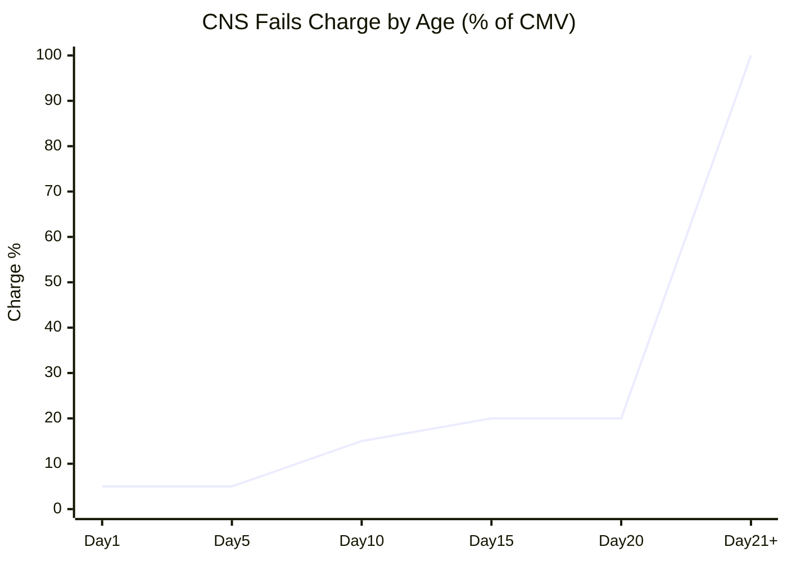

# CNS Fails Charge

Duration-based penalty charged to failing members. 2025 revision eliminated CRRM-based calculation.

---

## Charge Schedule



| Age (Days) | Rate | Example ($1M CMV) |
|------------|------|-------------------|
| 1-4 | 5% | $50,000 |
| 5-10 | 15% | $150,000 |
| 11-20 | 20% | $200,000 |
| 21+ | 100% | $1,000,000 |

---

## Calculation

```
Daily Charge = CMV × Aging Factor
```

| Variable | Definition |
|----------|------------|
| CMV | Current Market Value |
| Aging Factor | Rate from schedule above |

---

## 2025 Revision

| Aspect | Previous | Current |
|--------|----------|---------|
| Basis | CRRM (risk-based) | Duration (age-based) |
| Complexity | Variable | Fixed schedule |
| Predictability | Lower | Higher |

---

## Charge Trigger

| Event | Timing |
|-------|--------|
| Fail established | 3:00 PM ET cutoff |
| Charge starts | Day 1 |
| Daily accrual | Each fail day |

---

## Mitigation

| Action | Effect |
|--------|--------|
| Deliver shares | Stop accrual |
| [[partial-settlement]] | Reduce base CMV |
| [[stock-borrow-program\|SBP]] | Cover position |
| [[buy-in-mechanics\|Buy-in]] | Force resolution |

---

## Related
- [[cns-system]] - CNS architecture
- [[aged-fail-deductions]] - Additional capital impact
- [[settlement-lifecycle]] - Node 5 (Fail Established)
- [[fail-to-deliver]] - FTD lifecycle
- [[prioritization-logic]] - Cost in prioritization
