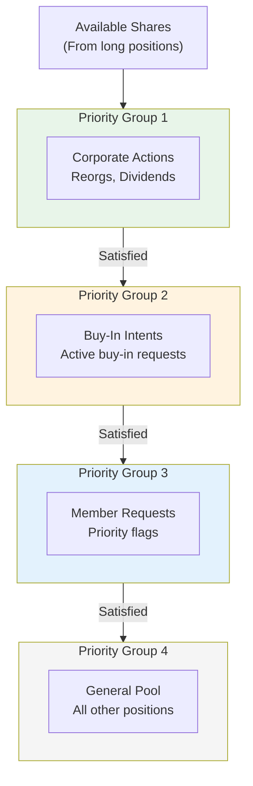
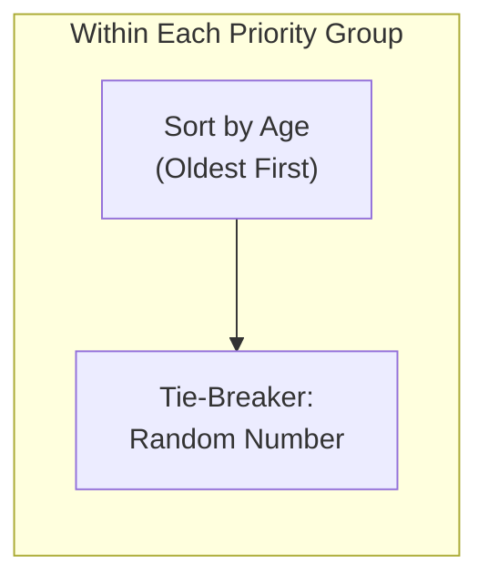

# CNS Priority Groups

Allocation hierarchy for CNS settlement. Determines order in which short positions receive available shares.

---

## Priority Hierarchy



---

## Group Definitions

### Priority Group 1: Corporate Actions
| Source | Examples |
|--------|----------|
| System-driven | Reorganizations |
| System-driven | Stock dividends |
| System-driven | Mandatory exchanges |
| System-driven | Rights distributions |

> [!info] Highest Priority
> Corporate action positions are system-assigned and receive first allocation. Members cannot request Group 1 status.

### Priority Group 2: Buy-In Intents
| Trigger | Action |
|---------|--------|
| [[buy-in-mechanics\|Buy-In Intent]] submitted | Position elevated to PG2 |
| Retransmittal Notice issued | Oldest short targeted |

**Elevation Process:**
1. Member submits Buy-In Intent
2. System elevates position to Priority Group 2
3. Position receives priority allocation in next cycle
4. If still unresolved → Retransmittal Notice

### Priority Group 3: Member Requests
| Type | Criteria |
|------|----------|
| Operational priority | Member-flagged positions |
| Customer settlement | Customer delivery requirements |
| Exception handling | Specific resolution needs |

**Request Limits:** Members have finite Priority Group 3 requests. Overuse dilutes effectiveness.

### Priority Group 4: General Pool
| Type | Description |
|------|-------------|
| Default | All positions not in Groups 1-3 |
| Majority | ~95% of positions |
| Allocation | Age-based within group |

---

## Within-Group Ordering



| Factor | Order | Purpose |
|--------|-------|---------|
| Age | Oldest first | Prevent perpetual fails |
| Random number | System-assigned | Fair tie-breaking |

### Age Calculation
| Metric | Definition |
|--------|------------|
| Fail age | Days since settlement date |
| Position age | Days in CNS system |
| Oldest | Highest priority within group |

---

## Allocation Example

```
Available: 1,000 shares of XYZ

Priority Group 1:
  - Corporate action: 200 shares → FILLED
  Remaining: 800 shares

Priority Group 2:
  - Buy-In Intent (Age 5): 500 shares → FILLED
  Remaining: 300 shares

Priority Group 3:
  - Member request (Age 3): 400 shares → PARTIAL (300)
  Remaining: 0 shares

Priority Group 4:
  - Position A (Age 7): 1,000 shares → FAIL
  - Position B (Age 2): 500 shares → FAIL
```

---

## Operational Implications

### Buy-In Strategy
| Factor | Consideration |
|--------|---------------|
| PG2 elevation | Significant advantage |
| Cost | Buy-in execution cost if unresolved |
| Timing | Submit before [[night-cycle]] for next-day priority |

### Member Request Strategy
| Factor | Consideration |
|--------|---------------|
| Limited requests | Use sparingly |
| Customer impact | Prioritize customer-affecting positions |
| Dilution | Too many requests reduce effectiveness |

---

## Integration with Settlement Cycles

### Night Cycle
See [[night-cycle]] for timing.

| Timing | Action |
|--------|--------|
| ~11:30 PM ET (S-1) | Priority Group allocation |
| 50% volume | Typical night cycle coverage |

### Day Cycle
See [[day-cycle]] for continuous processing.

| Timing | Action |
|--------|--------|
| 6:00 AM - 3:00 PM ET | Continuous recycling |
| Inventory arrival | Re-run allocation |

---

## Monitoring Integration

| Metric | Action |
|--------|--------|
| Position in PG4 > 5 days | Consider PG3 request |
| Position in PG4 > 10 days | Consider buy-in (PG2) |
| Multiple PG4 in same CUSIP | Review strategy |

---

## Related
- [[cns-system]] - CNS architecture
- [[night-cycle]] - Night allocation
- [[day-cycle]] - Day allocation
- [[buy-in-mechanics]] - PG2 elevation via buy-in
- [[settlement-lifecycle]] - Node 3 (Night Cycle Allocation)
- [[prioritization-logic]] - Internal priority scoring
