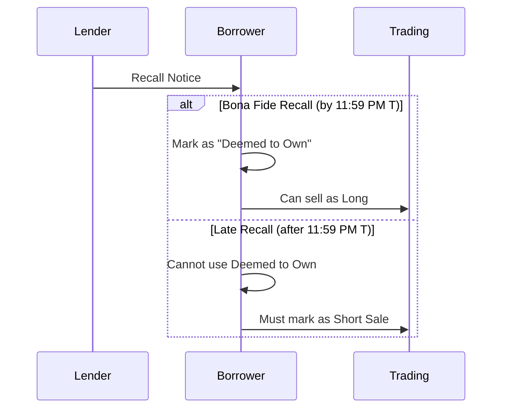

# Recalls

Request to return borrowed securities. Critical for "Deemed to Own" marking under Reg SHO Rule 200(g).

---

## Recall Workflow

---

## Bona Fide Deadline

| Era | Deadline |
|-----|----------|
| T+2 | 3:00 PM T+1 |
| T+1 | **11:59 PM T** |

> [!warning] Compressed Timeline
> T+1 requires same-day recall processing for next-day settlement.

---

## Deemed to Own (Rule 200(g))

| Requirement | Detail |
|-------------|--------|
| Bona fide recall | Received before deadline |
| Reasonable expectation | Shares will be received |
| Marking | Can mark sale as "Long" |

Without bona fide recall: Must mark as "Short Sale" → subject to [[reg-sho-rule-204]] close-out.

---

## Recall Timing Impact

| Recall Timing | Order Marking | Close-Out |
|---------------|---------------|-----------|
| Bona fide (on time) | Long | Standard |
| Late | Short | S+1 |
| No recall | Short | S+1 |

---

## Processing Pressure

| Factor | T+2 | T+1 |
|--------|-----|-----|
| Response time | ~24 hours | ~12 hours |
| Automation | Optional | Critical |
| Miss impact | Manageable | Severe |

---

## Related
- [[_MOC-exceptions]] - Exception overview
- [[reg-sho-rule-204]] - Close-out requirements
- [[fail-to-deliver]] - Result if recall not satisfied
- [[reclaims]] - Different exception type
