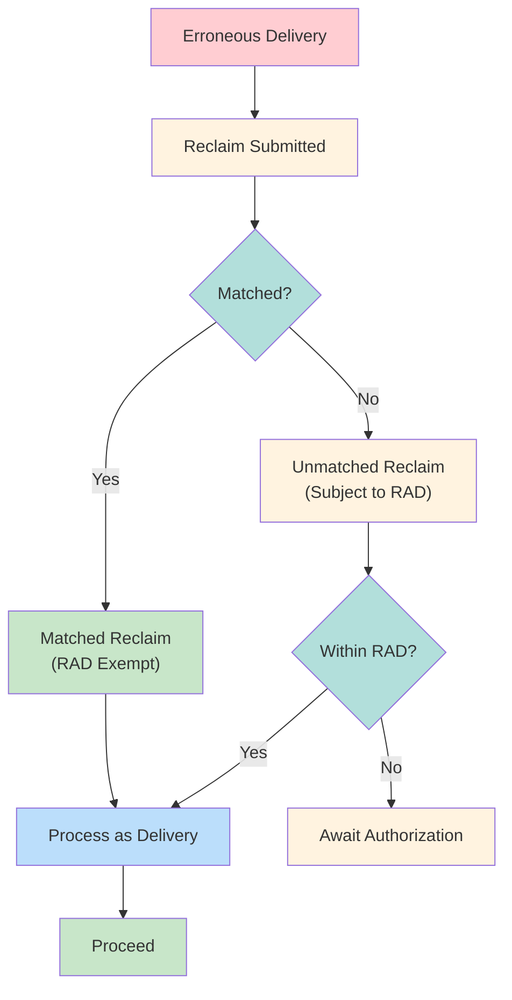

# Reclaims

Reversal of erroneous deliveries. Treated as new delivery instruction subject to RAD controls.

---

## Reclaim Flow

---

## Reclaim Types

| Code | Type | Description |
|------|------|-------------|
| 41-44 | DK Reclaims | Counterparty doesn't recognize |
| 45 | Mutilated/Wrong | Physical/data issue |
| 87-88 | Late/Stale | Timing issues |

See [[reclaim-reason-codes]] for full reference.

---

## Matched vs. Unmatched

| Aspect | Matched | Unmatched |
|--------|---------|-----------|
| Counterparty | Acknowledges | Disputes/unknown |
| RAD | Exempt | Subject to limits |
| Processing | Immediate | May be blocked |

---

## RAD Interaction

See [[rad-thresholds]] for limits.

| Scenario | RAD Treatment |
|----------|---------------|
| Matched reclaim | Exempt |
| Unmatched reclaim | Subject to RAD |
| Over threshold | Requires authorization |

---

## Decoupling Initiative

> [!info] Q3 2027
> DTCC decoupling initiative will decommission systemic linking between reclaims and original delivery.

| Current | Post-Decoupling |
|---------|-----------------|
| Linked to original | Independent instruction |
| Automatic pairing | Manual reconciliation |

---

## Related
- [[_MOC-exceptions]] - Exception overview
- [[reclaim-reason-codes]] - Code reference
- [[rad-thresholds]] - RAD controls
- [[dk-processing]] - Related exception
- [[recalls]] - Different exception type
