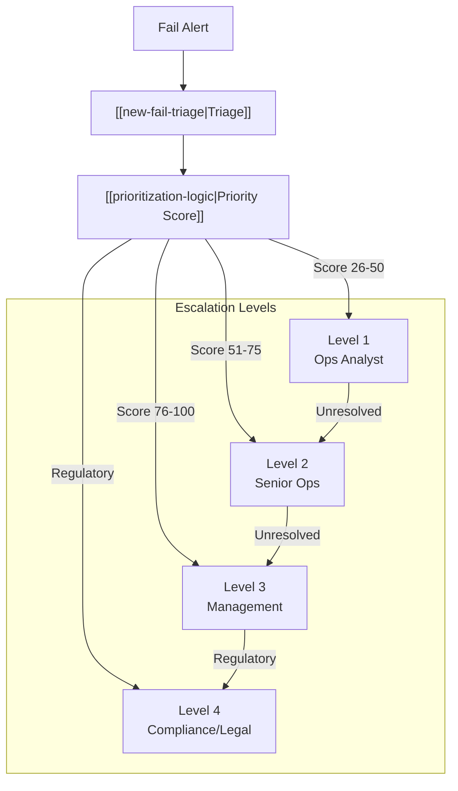

# Escalation Paths

When and how to escalate fail issues to appropriate parties.

---

## Escalation Flow

---

## Escalation Matrix

| Trigger | L1 Ops | L2 Senior | L3 Mgmt | L4 Compliance |
|---------|--------|-----------|---------|---------------|
| Age > 10 days | ✓ | | | |
| Age > 13 days | | ✓ | | |
| Age > 20 days | | | ✓ | |
| Age > 30 days | | | | ✓ |
| Value > $1M | ✓ | | | |
| Value > $5M | | ✓ | | |
| Value > $10M | | | ✓ | |
| [[threshold-securities\|Threshold]] | | ✓ | | |
| [[reg-sho-rule-204\|Close-out required]] | | | ✓ | |
| Regulatory inquiry | | | | ✓ |

---

## Level Procedures

### Level 1: Operations Analyst
| Trigger | Score 26-50 or Age > 10d |
|---------|-------------------------|
| SLA | 4 hours initial, 2 business days resolution |

**Actions:**
1. Review fail details in [[fail-lifecycle]]
2. Contact counterparty
3. Identify resolution path
4. Document actions taken

### Level 2: Senior Operations
| Trigger | Score 51-75 or Age > 13d or [[threshold-securities]] |
|---------|---------------------------------------------------|
| SLA | 2 hours initial, 1 business day resolution |

**Actions:**
1. Review analyst actions
2. Direct counterparty escalation
3. Evaluate [[offset-matching]] opportunities
4. Initiate [[stock-borrow-program]] if needed
5. Consider [[buy-in-mechanics\|buy-in]]

### Level 3: Management
| Trigger | Score 76-100 or [[reg-sho-rule-204\|Close-out required]] |
|---------|-------------------------------------------------------|
| SLA | 1 hour initial, same day resolution |

**Actions:**
1. Approve close-out purchases
2. Authorize [[buy-in-mechanics]]
3. Notify risk management
4. Review [[cns-fails-charge]] and [[aged-fail-deductions]] impact
5. Prepare for regulatory reporting

### Level 4: Compliance/Legal
| Trigger | Regulatory inquiry or violation imminent |
|---------|----------------------------------------|
| SLA | 30 minutes initial, immediate resolution |

**Actions:**
1. Prepare regulatory response
2. Document compliance efforts
3. Engage legal counsel
4. File required reports
5. Manage [[penalty-box]] implications

---

## Integration Points

| System | Integration |
|--------|-------------|
| [[new-fail-triage]] | Initial escalation assignment |
| [[prioritization-logic]] | Score-based routing |
| [[fail-lifecycle]] | State transition trigger |
| [[reg-sho-rule-204]] | Regulatory escalation |

---

## Notification Templates

| Level | Subject Format |
|-------|----------------|
| L1 | `[FAIL ALERT] {CUSIP} - {CP} - Age {N}d` |
| L2 | `[URGENT] Fail Escalation - {CUSIP} - ${Value}M` |
| L3 | `[CRITICAL] Management Review - {CUSIP}` |
| L4 | `[COMPLIANCE] Regulatory Action - {CUSIP}` |

---

## Response SLAs

| Level | Initial Response | Resolution Target |
|-------|------------------|-------------------|
| 1 | 4 hours | 2 business days |
| 2 | 2 hours | 1 business day |
| 3 | 1 hour | Same day |
| 4 | 30 minutes | Immediate |

---

## Related
- [[new-fail-triage]] - Entry point
- [[prioritization-logic]] - Score calculation
- [[fail-lifecycle]] - State transitions
- [[reg-sho-rule-204]] - Regulatory triggers
- [[buy-in-mechanics]] - Resolution option
