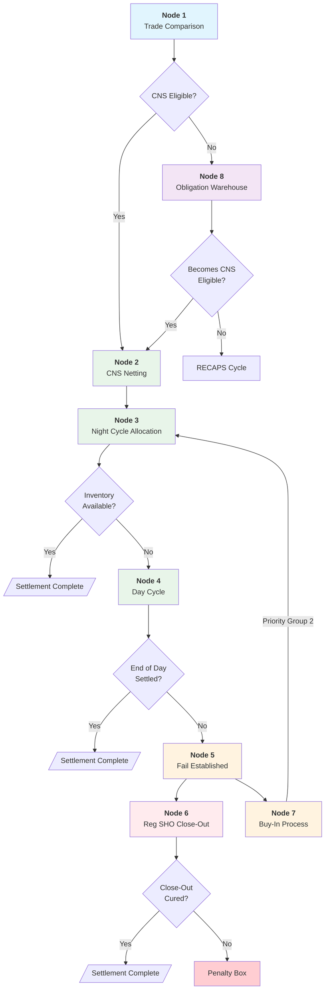

# Settlement Lifecycle

8-node decision tree from trade comparison to final settlement or Obligation Warehouse.

---

## Master Decision Tree

---

## Node Details

### Node 1: Trade Comparison
| Check | Outcome |
|-------|---------|
| CNS-eligible security | → Node 2 (CNS) |
| Ex-clearing trade | → Node 8 (OW) |
| CNS-ineligible security | → Node 8 (OW) |

**CNS Eligibility Factors:**
- Security registered in CNS
- Member participates in CNS
- Not explicitly ex-cleared

### Node 2: CNS Netting
See [[netting]] for mechanics.

| Action | Impact |
|--------|--------|
| Net settling trades | 98% reduction |
| Add closing positions | Prior day fails |
| Mark-to-market | Daily repricing |
| Calculate net position | Long or short |

### Node 3: Night Cycle Allocation
See [[night-cycle]] for timing (~11:30 PM ET, S-1).

| Priority | Category | Examples |
|----------|----------|----------|
| Group 1 | Corporate Actions | Reorgs, dividends |
| Group 2 | Buy-In Intents | Active buy-ins |
| Group 3 | Member Requests | Priority flags |
| Group 4 | General Pool | All others |

Within groups: Age (oldest first) → Random number tiebreaker

### Node 4: Day Cycle
See [[day-cycle]] for continuous processing.

| Event | Timing |
|-------|--------|
| Cycle start | 6:00 AM ET |
| Continuous recycling | As inventory arrives |
| Cutoff | 3:00 PM ET |

### Node 5: Fail Established
| Trigger | 3:00 PM ET cutoff without settlement |
|---------|--------------------------------------|
| Action | Fail recorded in CNS |
| Impact | [[cns-fails-charge]] clock starts |
| Next | Node 6 (Reg SHO) or Node 7 (Buy-In) |

### Node 6: Reg SHO Close-Out
See [[reg-sho-rule-204]] for deadlines.

| Position Type | Deadline | Failure Result |
|---------------|----------|----------------|
| Short sale | S+1 market open | [[penalty-box]] |
| Long sale | S+3 market open | [[penalty-box]] |
| Market maker | S+3 (extended) | [[penalty-box]] |
| [[threshold-securities\|Threshold]] | S+13 | Mandatory purchase |

### Node 7: Buy-In Process
See [[buy-in-mechanics]] for workflow.

| Step | Action |
|------|--------|
| 1 | Submit Buy-In Intent |
| 2 | Elevate to [[priority-groups\|Priority Group 2]] |
| 3 | Retransmittal Notice to oldest short |
| 4 | Market execution if needed |

### Node 8: Obligation Warehouse
See [[obligation-warehouse]] for bilateral settlement.

| Function | Description |
|----------|-------------|
| Storage | Hold non-CNS obligations |
| [[recaps\|RECAPS]] | Mark-to-market cycles |
| [[cns-eligibility-scan\|CNS Scan]] | Daily rescue to CNS |
| Settlement | Bilateral delivery |

---

## Financial Implications by Node

| Node | Capital Treatment | Cost Driver |
|------|-------------------|-------------|
| 2 (CNS) | Net position, margin offsets | Lowest |
| 5 (Fail) | [[cns-fails-charge]] starts | 5-100% CMV |
| 6 (Reg SHO) | [[aged-fail-deductions\|Haircuts]] begin S+5 | Capital at risk |
| 8 (OW) | Gross exposure, no margin offset | Higher |

---

## Key Metrics

| Metric | Value | Source |
|--------|-------|--------|
| Night Cycle coverage | ~50% of volume | DTCC |
| Netting efficiency | ~98% reduction | DTCC |
| STP cost | $0.37 | Industry |
| Fail cost | $30-50 | Industry |

---

## Related
- [[_INDEX]] - Knowledge base entry point
- [[cns-system]] - CNS architecture
- [[obligation-warehouse]] - Node 8 details
- [[priority-groups]] - Allocation hierarchy
- [[reg-sho-rule-204]] - Node 6 deadlines
- [[buy-in-mechanics]] - Node 7 process
- [[new-fail-triage]] - Post-fail processing
