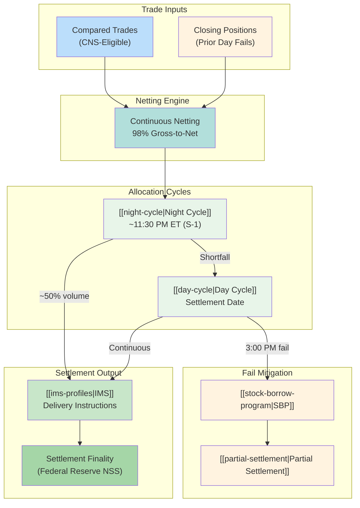

# CNS System

Continuous Net Settlement - NSCC's core clearing system providing [[novation]] and [[netting]] for equity settlement.

---

## Architecture Overview

---

## Core Functions

### 1. Novation
See [[novation]] for details.

| Aspect | Before Novation | After Novation |
|--------|-----------------|----------------|
| Counterparty | Bilateral (A ↔ B) | CCP (A ↔ NSCC ↔ B) |
| Guarantee | None | NSCC guarantee |
| Anonymity | Known | Anonymous |
| Capital | Gross exposure | Net exposure |

### 2. Netting
See [[netting]] for details.

| Metric | Value |
|--------|-------|
| Gross-to-Net Reduction | ~98% |
| Balance Sheet Impact | Net vs. gross booking |
| Margin Benefit | Offsetting positions |

### 3. Allocation
See [[priority-groups]] for hierarchy.

| Priority Group | Category | Source |
|----------------|----------|--------|
| 1 | Corporate Actions/Reorgs | System |
| 2 | Buy-In Intents | Member request |
| 3 | Member Priority Requests | Member request |
| 4 | General Pool | Default |

Within groups: Sort by age (oldest first), then random number tiebreaker.

---

## Processing Timeline (T+1)

| Time | Event | Details |
|------|-------|---------|
| 9:00 PM ET (T) | Affirmation deadline | Institutional trades |
| 10:45 PM ET (T) | CNS exemption cutoff | IMS hold requests |
| 11:30 PM ET (S-1) | Night Cycle start | ~50% volume allocated |
| 6:00 AM ET (S) | Day Cycle start | Continuous allocation |
| 3:00 PM ET (S) | Settlement cutoff | Fails established |
| 3:30 PM ET (S) | Money settlement | Federal Reserve NSS |

See [[t1-critical-deadlines]] for complete timeline.

---

## Fail Management

### CNS Fails Charge
See [[cns-fails-charge]] for duration-based penalties.

| Age | Rate |
|-----|------|
| 1-4 days | 5% of CMV |
| 5-10 days | 15% of CMV |
| 11-20 days | 20% of CMV |
| 21+ days | 100% of CMV |

### Fail Mitigation Tools
| Tool | Function | Page |
|------|----------|------|
| Stock Borrow Program | Borrow to cover short | [[stock-borrow-program]] |
| Partial Settlement | Deliver available shares | [[partial-settlement]] |
| Buy-In | Force resolution | [[buy-in-mechanics]] |

---

## Capital Treatment

| Aspect | CNS | Bilateral |
|--------|-----|-----------|
| Counterparty risk | CCP guaranteed | Direct exposure |
| Margin offsets | Yes | No |
| Balance sheet | Net position | Gross positions |
| Aged fail haircut | Same Rule 15c3-1 | Same Rule 15c3-1 |

---

## Cross-Endorsement

> [!info] DTC-NSCC Guarantee
> Cross-Endorsement Agreement between DTC and NSCC provides that each guarantees the other's obligations, creating settlement finality upon Federal Reserve NSS file processing.

---

## Related
- [[_MOC-settlement]] - Settlement systems overview
- [[novation]] - Legal transformation mechanics
- [[netting]] - Netting calculation details
- [[priority-groups]] - Allocation hierarchy
- [[night-cycle]] - Night allocation process
- [[day-cycle]] - Day allocation process
- [[ims-profiles]] - Downstream delivery control
- [[obligation-warehouse]] - Alternative (bilateral) path
