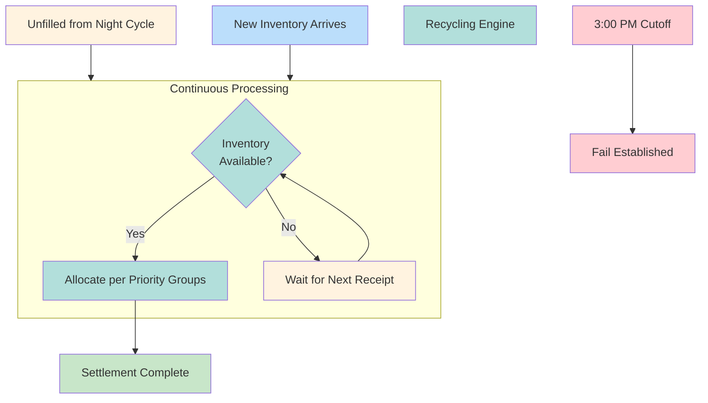

# Day Cycle

Continuous CNS allocation on settlement date. Processes positions not filled in [[night-cycle]].

---

## Timeline

| Time | Event |
|------|-------|
| 6:00 AM ET | Day Cycle start |
| Continuous | Recycling as inventory arrives |
| 3:00 PM ET | Settlement cutoff |
| 3:30 PM ET | Money settlement finality |

---

## Processing Logic

---

## Key Characteristics

| Aspect | Day Cycle |
|--------|-----------|
| Processing | Continuous (not batch) |
| Trigger | Inventory arrival |
| Priority | Same [[priority-groups]] |
| Duration | 6:00 AM - 3:00 PM ET |

---

## Inventory Sources

| Source | Description |
|--------|-------------|
| Inbound deliveries | Counterparty settlements |
| Recalls returned | [[recalls]] satisfied |
| Borrows | [[stock-borrow-program]] |
| Purchases | Market acquisitions |

---

## Fail Establishment

> [!warning] 3:00 PM Cutoff
> Positions not settled by 3:00 PM ET become official fails. [[cns-fails-charge]] clock starts.

| Pre-Cutoff | Post-Cutoff |
|------------|-------------|
| Position pending | Fail recorded |
| No charge | Charge accrues |
| Settlement possible | Next day earliest |

---

## Related
- [[cns-system]] - CNS architecture
- [[night-cycle]] - Prior cycle
- [[priority-groups]] - Allocation hierarchy
- [[cns-fails-charge]] - Post-fail charges
- [[settlement-lifecycle]] - Node 4 (Day Cycle)
