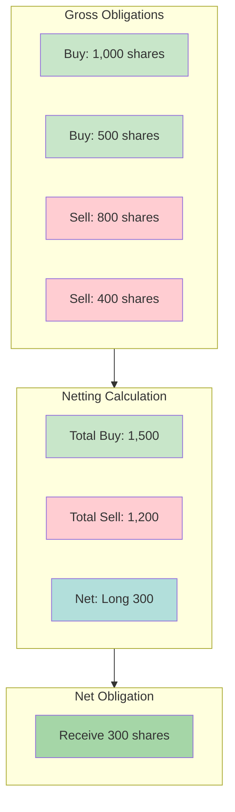

# Netting

Continuous reduction of gross settlement obligations to net positions. CNS achieves ~98% gross-to-net reduction.

---

## Netting Process

| Metric | Value |
|--------|-------|
| Gross obligations | 2,700 shares |
| Net obligation | 300 shares |
| Reduction | 89% |
| Typical CNS average | ~98% |

---

## Netting Components

### Settling Trades
| Source | Timing |
|--------|--------|
| New trades | T+0 comparison |
| Compared | Matched trades |

### Closing Positions
| Source | Timing |
|--------|--------|
| Prior day fails | Rolled forward |
| Resubmitted | After processing |

---

## Financial Impact

| Aspect | Gross | Net |
|--------|-------|-----|
| Deliveries | Each trade | Net position |
| Payments | Each trade | Net payment |
| Balance sheet | Sum of trades | Net exposure |
| Capital | Gross exposure | Net exposure |

---

## Netting Cycles

| Cycle | Timing | Purpose |
|-------|--------|---------|
| Intraday | Continuous | Real-time netting |
| [[night-cycle]] | 11:30 PM ET | End-of-day positions |
| [[day-cycle]] | 6:00 AM - 3:00 PM | Settlement day |

---

## Related
- [[cns-system]] - CNS architecture
- [[novation]] - Pre-netting transformation
- [[night-cycle]] - Night netting cycle
- [[day-cycle]] - Day netting cycle
