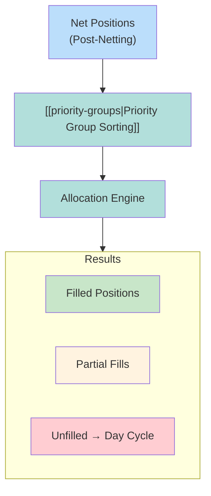

# Night Cycle

Primary CNS allocation cycle running evening before settlement date. Processes ~50% of daily volume.

---

## Timeline

```mermaid
gantt
    title Night Cycle Timeline (T+1)
    dateFormat HH:mm
    axisFormat %H:%M

    section Trade Date (T)
    Trade Execution        :t1, 09:30, 6h30m
    Affirmation Deadline   :crit, 21:00, 30m
    CNS Exemption Cutoff   :crit, 22:45, 15m
    Night Cycle Start      :active, 23:30, 30m

    section Settlement Date (S)
    Night Cycle Processing :active, 00:00, 2h
    Day Cycle Start        :06:00, 9h
```

| Time | Event |
|------|-------|
| 9:00 PM ET (T) | Affirmation deadline |
| 10:45 PM ET (T) | CNS exemption cutoff |
| ~11:30 PM ET (T→S) | Night Cycle start |
| ~2:00 AM ET (S) | Night Cycle complete |

---

## Allocation Process

### Priority Group Order
| Group | Category |
|-------|----------|
| 1 | Corporate Actions |
| 2 | Buy-In Intents |
| 3 | Member Requests |
| 4 | General Pool |

Within groups: Age (oldest first) → Random tiebreaker

---

## Volume Statistics

| Metric | Value |
|--------|-------|
| Night Cycle coverage | ~50% of daily volume |
| Remaining | → [[day-cycle]] |

---

## IMS Integration

Night Cycle results flow to [[ims-profiles]] for delivery:

| Profile | Processing |
|---------|------------|
| Green | Immediate |
| Yellow | Sequenced |
| Red | Manual hold |

---

## Related
- [[cns-system]] - CNS architecture
- [[day-cycle]] - Continuation processing
- [[priority-groups]] - Allocation hierarchy
- [[ims-profiles]] - Downstream delivery
- [[t1-critical-deadlines]] - Timeline reference
