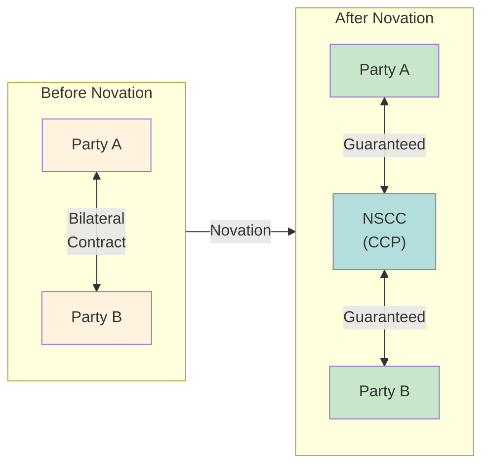

# Novation

Legal transformation of bilateral trade obligations into CCP-guaranteed obligations through NSCC.

---

## Transformation

| Aspect | Before | After |
|--------|--------|-------|
| Counterparty | Known (Party B) | Anonymous (NSCC) |
| Guarantee | None | CCP guarantee |
| Default risk | Direct exposure | Loss mutualization |
| Settlement | Bilateral | Centralized |

---

## Benefits

| Benefit | Description |
|---------|-------------|
| Anonymity | Trading counterparty hidden |
| Guarantee | NSCC backs all positions |
| [[netting]] | 98% gross-to-net reduction |
| Capital efficiency | Net exposure only |
| Margin offsets | Long/short position offsets |

---

## Timing

| Event | Timing |
|-------|--------|
| Trade execution | T |
| Trade comparison | T (real-time) |
| Novation | Upon comparison match |
| Settlement | T+1 |

---

## Legal Effect

> [!info] Contract Replacement
> Original bilateral contract is extinguished and replaced with two separate contracts: Party A ↔ NSCC and NSCC ↔ Party B.

---

## Related
- [[cns-system]] - CNS architecture
- [[netting]] - Post-novation netting
- [[obligation-warehouse]] - Non-novated alternative
