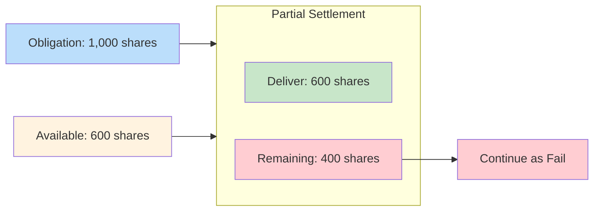

# Partial Settlement

Delivery of available shares when full quantity unavailable. Reduces fail magnitude incrementally.

---

## Mechanism

| Component | Shares |
|-----------|--------|
| Original obligation | 1,000 |
| Partial delivery | 600 |
| Remaining fail | 400 |

---

## Benefits

| Benefit | Description |
|---------|-------------|
| Reduced exposure | Smaller fail balance |
| Counterparty credit | Partial receives |
| [[cns-fails-charge]] | Charges on remainder only |

---

## Processing

| Timing | Action |
|--------|--------|
| [[day-cycle]] | Continuous partial delivery |
| End of day | Remaining becomes fail |
| Next day | Rolls into [[night-cycle]] |

---

## Related
- [[cns-system]] - CNS architecture
- [[day-cycle]] - Processing timing
- [[stock-borrow-program]] - Alternative mitigation
- [[cns-fails-charge]] - Cost on remainder
