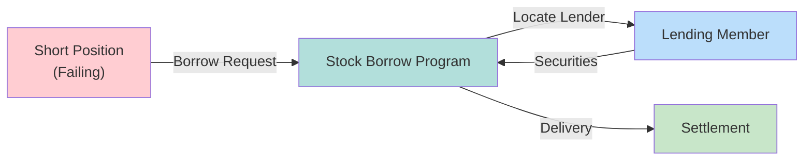

# Stock Borrow Program (SBP)

NSCC's securities lending facility to cover short positions and prevent fails. Usage declined 95% since mid-2000s.

---

## Mechanism

---

## Key Characteristics

| Aspect | Detail |
|--------|--------|
| Purpose | Cover short positions |
| Operator | NSCC |
| Voluntary | Lender participation optional |
| Decline | Down 95% since mid-2000s |

---

## Decline Factors

| Factor | Impact |
|--------|--------|
| Bilateral lending efficiency | More attractive terms |
| Direct relationships | Bypasses SBP |
| Market evolution | Better alternatives |

---

## Liability Note

> [!warning] Borrower Remains Liable
> SBP borrow does NOT extinguish the underlying obligation. The failing member remains liable to return securities.

---

## Related
- [[cns-system]] - Parent system
- [[partial-settlement]] - Alternative mitigation
- [[cns-fails-charge]] - Fail cost if SBP insufficient
