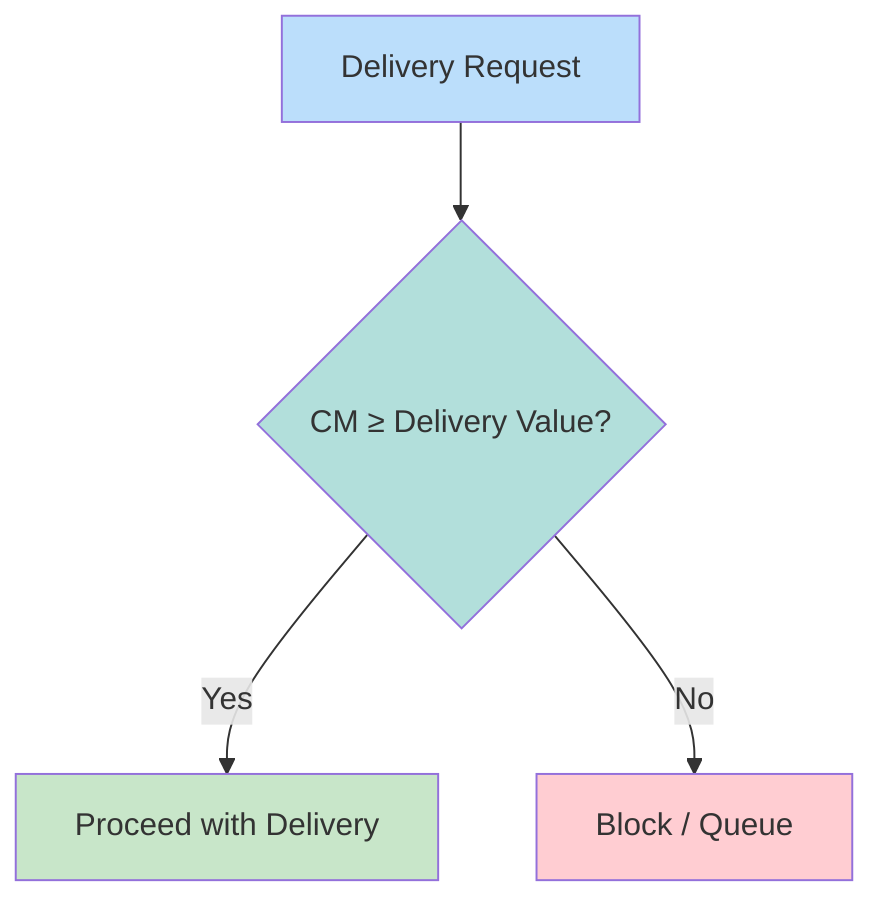

# Collateral Monitor (CM)

IMS solvency check ensuring adequate collateral value before allowing deliveries.

---

## Calculation

```
Collateral Value = Σ (Position Value × (1 - Haircut))
```

| Component | Description |
|-----------|-------------|
| Position Value | Market value of holdings |
| Haircut | Risk-based deduction (%) |
| Collateral Value | Net acceptable collateral |

---

## Haircut Examples

| Security Type | Typical Haircut |
|---------------|-----------------|
| US Treasury | 2-5% |
| Investment Grade | 5-10% |
| Equity | 15-30% |
| High Yield | 20-40% |

---

## Threshold Check



---

## Interaction with IMS

| [[ims-profiles\|Profile]] | CM Behavior |
|---------|-------------|
| Green | Block if CM insufficient |
| Yellow | Block + queue |
| Red | Manual approval required |

---

## Related
- [[ims-profiles]] - IMS profile system
- [[net-debit-cap]] - Liquidity constraint (complementary)
- [[settlement-progress-payment]] - Liquidity release
