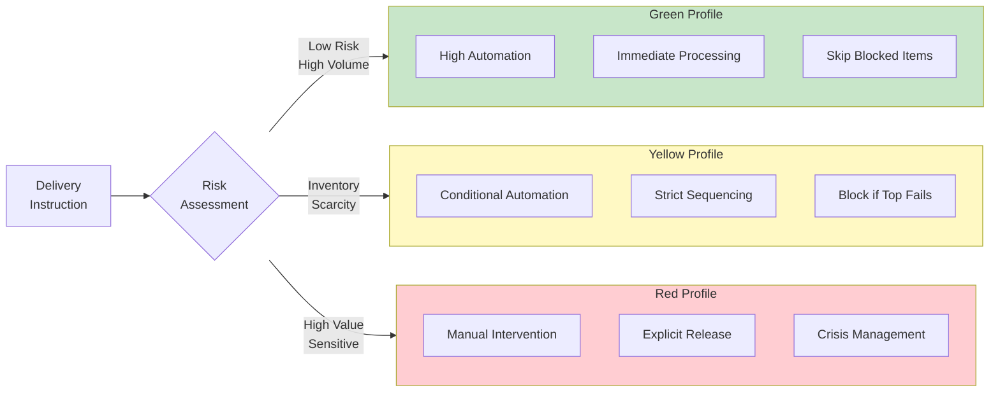
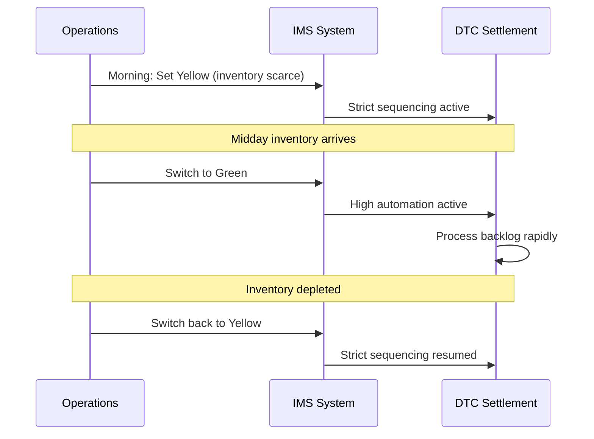
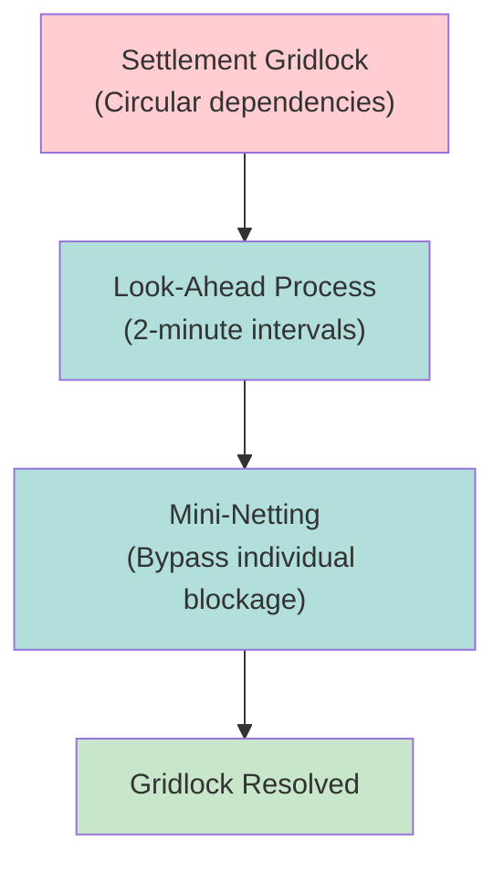

# IMS Profiles

DTC's Inventory Management System controls delivery sequencing via Green/Yellow/Red profile automation levels.

---

## Profile Overview

---

## Profile Definitions

### Green Profile (High Automation)
| Aspect | Behavior |
|--------|----------|
| Processing | Immediate, automated |
| Sequencing | No preference |
| Blocked items | Skip and continue |
| Use case | High-volume, low-risk |

**Characteristics:**
- Maximum throughput
- No manual intervention required
- Failed items don't block queue
- Typical for liquid securities

### Yellow Profile (Conditional)
| Aspect | Behavior |
|--------|----------|
| Processing | Conditional automation |
| Sequencing | Strict (top-of-queue first) |
| Blocked items | Block entire queue |
| Use case | Inventory management |

**Characteristics:**
- Reserved sequencing preferences
- Top-of-queue failure blocks all
- Useful for scarce inventory
- Prevents "cherry-picking"

### Red Profile (Manual)
| Aspect | Behavior |
|--------|----------|
| Processing | Manual release only |
| Sequencing | Explicit control |
| Blocked items | Held until released |
| Use case | High-value, crisis |

**Characteristics:**
- Full manual control
- Explicit authorization required
- Used for sensitive situations
- Crisis management mode

---

## Switch-To/Switch-Back Strategy

> [!info] Dynamic Profiling
> Members can dynamically switch profiles based on inventory conditions.

| Phase | Profile | Reason |
|-------|---------|--------|
| Morning (scarce) | Yellow | Preserve inventory |
| Post-receipt | Green | Process rapidly |
| Inventory depleted | Yellow | Resume control |

---

## Authorization Modes

### Passive Authorization
| Mode | Behavior |
|------|----------|
| Default | System processes per profile |
| No action | Delivery proceeds |
| Override | Manual intervention available |

### Active Authorization
| Mode | Behavior |
|------|----------|
| Required | Explicit release needed |
| Hold | Delivery queued pending approval |
| Release | Manual trigger to proceed |

---

## IMS Controls

### Collateral Monitor (CM)
See [[collateral-monitor]] for details.

| Function | Purpose |
|----------|---------|
| Solvency check | Ensure adequate collateral |
| Haircut calculation | Risk-adjusted values |
| Threshold | Minimum collateral requirement |

### Net Debit Cap (NDC)
See [[net-debit-cap]] for details.

| Limit | Value |
|-------|-------|
| Individual | $2.15B |
| Family | $2.85B |
| Purpose | Liquidity constraint |

### Receiver Authorized Delivery (RAD)
See [[rad-thresholds]] for details.

| Function | Purpose |
|----------|---------|
| Threshold limits | Prevent "dumping" |
| Authorization | Receiver controls large deliveries |
| Override | Manual approval for over-threshold |

---

## Look-Ahead Process

See [[look-ahead-process]] for details.

| Aspect | Detail |
|--------|--------|
| Frequency | Every 2 minutes |
| Function | Identify gridlock patterns |
| Resolution | Mini-netting bypasses blockage |
| Override | Ignores individual sequencing |

---

## Settlement Progress Payment (SPP)

See [[settlement-progress-payment]] for details.

| Function | Mechanism |
|----------|-----------|
| Intraday liquidity | Fedwire payment valve |
| Trigger | Net debit approaching cap |
| Effect | Release cash to continue settlement |

---

## Cost Implications

| Outcome | Cost |
|---------|------|
| STP delivery | $0.37 |
| Failed delivery | $30-50 |
| Fail escalation | [[cns-fails-charge]] + [[aged-fail-deductions]] |

---

## Profile Selection Guidelines

| Condition | Recommended Profile |
|-----------|---------------------|
| High-volume, liquid | Green |
| Scarce inventory | Yellow |
| Customer settlement priority | Yellow |
| High-value position | Yellow/Red |
| Crisis/incident | Red |
| End-of-day push | Green |

---

## Related
- [[_MOC-settlement]] - Settlement systems
- [[cns-system]] - Upstream CNS allocation
- [[collateral-monitor]] - CM solvency check
- [[net-debit-cap]] - NDC liquidity limit
- [[look-ahead-process]] - Gridlock resolution
- [[settlement-progress-payment]] - SPP liquidity
- [[rad-thresholds]] - RAD controls
