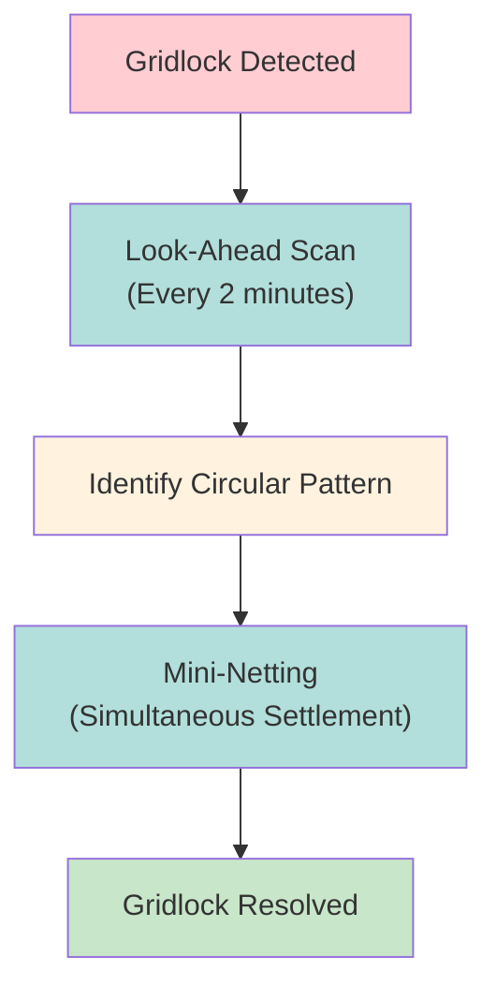

# Look-Ahead Process

IMS gridlock resolution mechanism running every 2 minutes to identify and resolve circular dependencies.

---

## Gridlock Example

All three blocked - no individual can proceed.

---

## Look-Ahead Resolution

---

## Characteristics

| Aspect | Detail |
|--------|--------|
| Frequency | Every 2 minutes |
| Function | Identify gridlock patterns |
| Resolution | Mini-netting (simultaneous) |
| Override | Ignores individual sequencing |

---

## Override Behavior

> [!info] Sequencing Override
> Look-Ahead may override individual [[ims-profiles]] sequencing preferences to resolve gridlock.

---

## Related
- [[ims-profiles]] - IMS profile system
- [[net-debit-cap]] - Liquidity constraint
- [[settlement-progress-payment]] - Alternative liquidity
