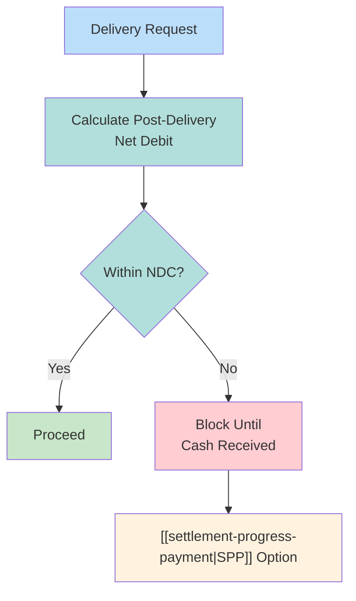

# Net Debit Cap (NDC)

DTC liquidity limit constraining maximum net debit position during settlement.

---

## Limits

| Type | Limit |
|------|-------|
| Individual member | $2.15 billion |
| Family (affiliates) | $2.85 billion |

---

## Mechanism

---

## NDC vs. Collateral Monitor

| Aspect | [[collateral-monitor\|CM]] | NDC |
|--------|-----|-----|
| Purpose | Solvency | Liquidity |
| Constraint | Collateral value | Cash flow |
| Threshold | Value-based | Dollar cap |

---

## Approaching NDC

| Action | Purpose |
|--------|---------|
| [[settlement-progress-payment\|SPP]] | Release cash via Fedwire |
| Delay deliveries | Reduce outflows |
| Prioritize receipts | Increase inflows |

---

## Related
- [[ims-profiles]] - IMS profile system
- [[collateral-monitor]] - Solvency constraint
- [[settlement-progress-payment]] - Liquidity release
- [[look-ahead-process]] - Gridlock resolution
