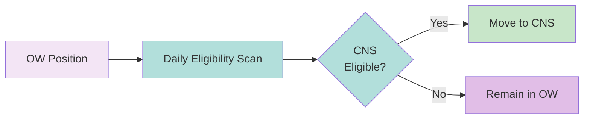

# CNS Eligibility Scan

Daily process to identify [[obligation-warehouse]] positions that have become CNS-eligible for "rescue" to CNS.

---

## Mechanism

---

## Eligibility Factors

| Factor | Requirement |
|--------|-------------|
| Security | CNS-eligible (registered) |
| Member | CNS participant |
| Trade type | Not explicitly ex-cleared |

---

## Rescue Benefits

| Benefit | Description |
|---------|-------------|
| CCP guarantee | NSCC backs position |
| [[netting]] | Join CNS netting |
| Capital | Net vs. gross treatment |
| Margin offset | Available in CNS |

---

## Timing

| Aspect | Detail |
|--------|--------|
| Frequency | Daily |
| Timing | Prior to [[night-cycle]] |
| Effect | Immediate CNS inclusion |

---

## Related
- [[obligation-warehouse]] - Source system
- [[cns-system]] - Destination system
- [[recaps]] - Alternative (stay in OW)
