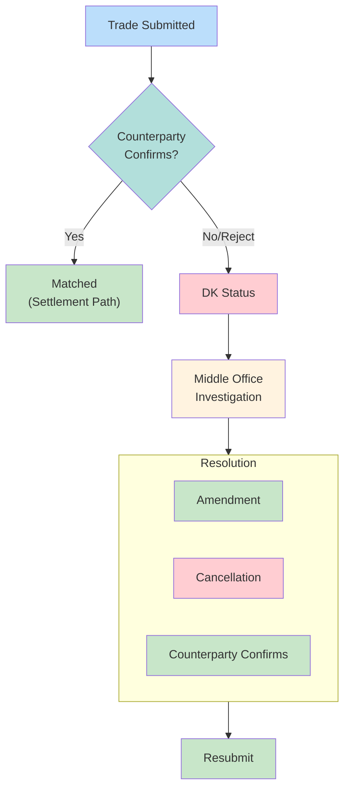

# DK Processing

"Don't Know" resolution for trades where counterparty doesn't recognize the obligation.

---

## DK Flow

---

## DK Reason Codes

| Code | Meaning | Resolution |
|------|---------|------------|
| 41 | Unknown trade | Trade comparison |
| 42 | Wrong quantity | Amendment |
| 43 | Wrong price | Amendment |
| 44 | Wrong security | Amendment |

See [[dtc-reason-codes]] for full reference.

---

## Investigation Steps

| Step | Action |
|------|--------|
| 1 | Receive DK notification |
| 2 | Identify reason code |
| 3 | Compare trade details |
| 4 | Contact counterparty |
| 5 | Agree on correction |
| 6 | Submit amendment or cancel |

---

## T+1 Impact

> [!warning] Compressed Timeline
> T+1 settlement compresses DK resolution time. Automation critical.

| T+2 Era | T+1 Era |
|---------|---------|
| Next-day resolution | Same-day resolution |
| Manual acceptable | Automation required |

---

## Related
- [[obligation-warehouse]] - Parent system
- [[dtc-reason-codes]] - Code reference
- [[_MOC-exceptions]] - Exception overview
- [[reclaims]] - Related exception type
