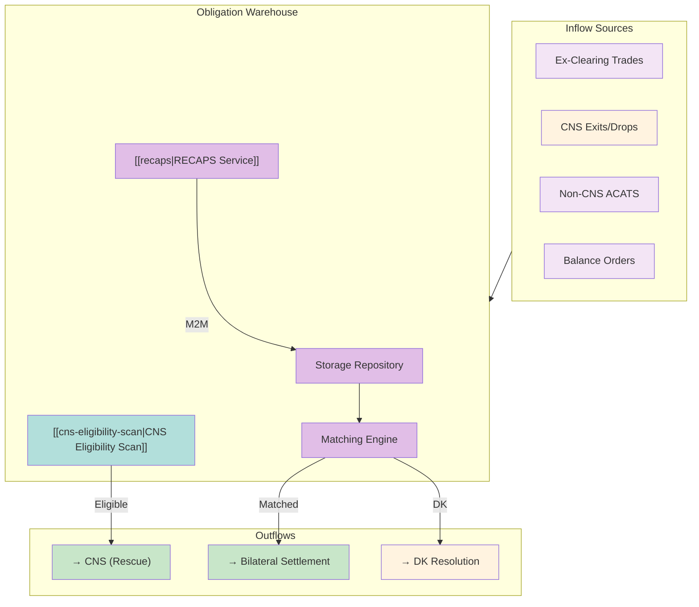
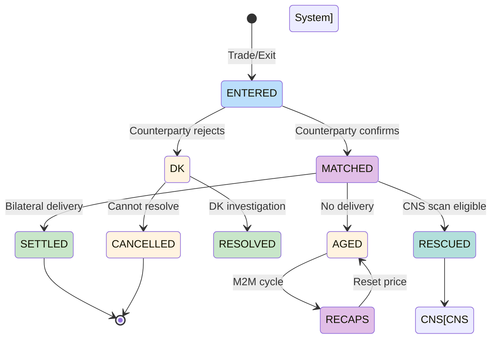

# Obligation Warehouse

Centralized repository for bilateral (ex-clearing) trades. No CCP guarantee - tracks ~trillions in off-CCP liabilities.

---

## Architecture Overview

---

## Core Functions

### 1. Storage
| Function | Description |
|----------|-------------|
| Repository | Hold non-CNS obligations |
| Tracking | Counterparty-level detail |
| Aging | Days outstanding |
| Value | Mark-to-market |

### 2. Matching Engine
| Status | Meaning |
|--------|---------|
| Matched | Both parties confirm |
| Unmatched | One party confirms |
| DK (Don't Know) | Counterparty rejects |

See [[dk-processing]] for DK resolution.

### 3. RECAPS Service
See [[recaps]] for mark-to-market mechanics.

| Function | Frequency |
|----------|-----------|
| Mark-to-market | Monthly/biweekly |
| Cash adjustment | Difference payment |
| Price reset | New reference price |

### 4. CNS Eligibility Scan
See [[cns-eligibility-scan]] for rescue mechanics.

| Function | Timing |
|----------|--------|
| Daily scan | Check CNS eligibility |
| Rescue | Move to CNS if eligible |
| Benefit | Gain CCP guarantee |

---

## OW vs. CNS Comparison

| Aspect | CNS | OW (Bilateral) |
|--------|-----|----------------|
| Guarantee | CCP (NSCC) | None |
| Counterparty | Anonymous | Known |
| Booking | Net position | Gross exposure |
| Margin offset | Yes | No |
| [[netting]] | Automatic | Manual only |
| Settlement | Centralized | Bilateral |
| Fail treatment | [[cns-fails-charge]] | Balance sheet + haircuts |

---

## Balance Sheet Impact

> [!warning] Gross Exposure
> OW positions book as gross receivables/payables without netting benefit.

| Treatment | CNS | OW |
|-----------|-----|-----|
| Receivable | Net long only | Each FTR position |
| Payable | Net short only | Each FTD position |
| Total exposure | Net | Sum of gross |

### Capital Implications
| Factor | Impact |
|--------|--------|
| No margin offset | Higher capital requirement |
| Gross booking | Balance sheet inflation |
| Aged fails | Same [[aged-fail-deductions]] apply |
| Counterparty risk | Direct exposure |

---

## OW Lifecycle

---

## Inflow Sources

| Source | Description |
|--------|-------------|
| Ex-clearing trades | Intentionally bilateral |
| CNS exits | Security becomes ineligible |
| CNS drops | Member requests bilateral |
| Non-CNS ACATS | Account transfer positions |
| Balance orders | Adjustment entries |

### CNS Exit Triggers
| Trigger | Reason |
|---------|--------|
| Security delisting | No longer CNS-eligible |
| Member election | Explicit bilateral preference |
| Corporate action | Complex event handling |

---

## Regulatory Considerations

### Regulation SHO
| Aspect | OW Treatment |
|--------|--------------|
| Close-out | Same deadlines apply |
| Threshold | Same 13-day rule |
| Penalty Box | Same restrictions |

### Rule 15c3-1
| Aspect | OW Treatment |
|--------|--------------|
| Aged fails | Same haircut schedule |
| S+5 start | Same timing |
| 100% at S+21 | Same |

### Key Difference
| Factor | CNS | OW |
|--------|-----|-----|
| Counterparty risk | CCP-guaranteed | Direct exposure |
| Default scenario | NSCC loss sharing | Direct loss |
| Mark-to-market | Daily | [[recaps]] cycle |

---

## DTCC Exception Manager

| Function | Benefit |
|----------|---------|
| Workflow automation | Streamline exception handling |
| Counterparty communication | Integrated messaging |
| DK resolution | Guided investigation |
| Status tracking | Real-time visibility |

---

## Monitoring Priorities

| Factor | OW-Specific |
|--------|-------------|
| Gross exposure | Track total OW balance |
| Counterparty concentration | Single-name risk |
| Aging | Days outstanding |
| RECAPS timing | Next M2M cycle |
| CNS rescue | Eligibility changes |

---

## Related
- [[_MOC-settlement]] - Settlement systems
- [[cns-system]] - Alternative (guaranteed) path
- [[recaps]] - Mark-to-market cycle
- [[cns-eligibility-scan]] - Rescue mechanism
- [[dk-processing]] - DK resolution
- [[settlement-lifecycle]] - Node 8 (Obligation Warehouse)
- [[aged-fail-deductions]] - Capital impact
