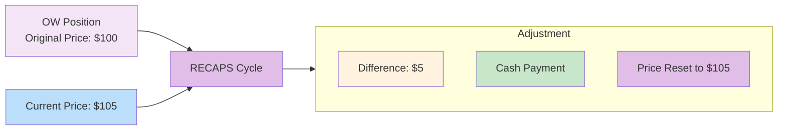

# RECAPS

Reconfirmation and Pricing Service - mark-to-market cycle for [[obligation-warehouse]] positions.

---

## Mechanism

---

## Cycle Frequency

| Historical | Current Trend |
|------------|---------------|
| Quarterly | Monthly/biweekly |

> [!info] Increased Frequency
> RECAPS frequency has increased to force more frequent realization of gains/losses.

---

## Process

| Step | Action |
|------|--------|
| 1 | Identify OW positions |
| 2 | Determine current market price |
| 3 | Calculate difference from book price |
| 4 | Cash adjustment (payment/receipt) |
| 5 | Reset position to current price |

---

## Risk Implications

| Risk | Description |
|------|-------------|
| Mark-to-market loss | Cash outflow on price increase (short) |
| Counterparty default | Clawback risk before settlement |
| Liquidity | Cash requirement on repricing |

---

## Related
- [[obligation-warehouse]] - Parent system
- [[cns-eligibility-scan]] - Alternative (CNS rescue)
- [[dk-processing]] - Position validation
