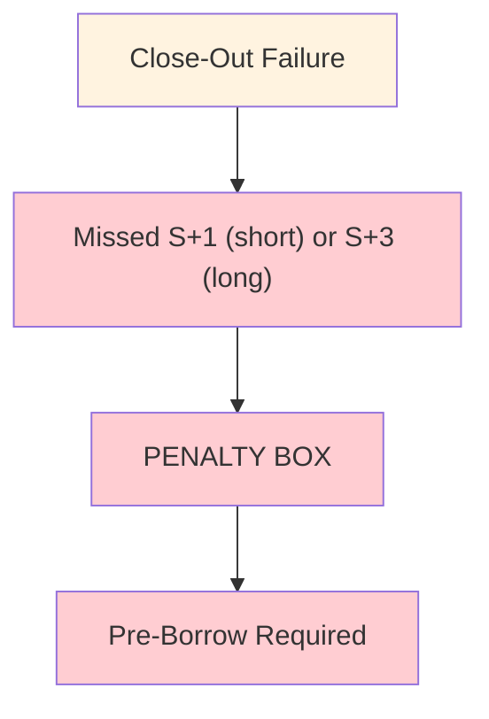
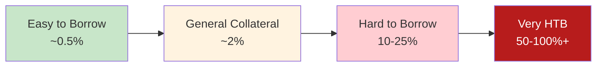

# Penalty Box

Pre-borrow restriction triggered by [[reg-sho-rule-204]] close-out failure. Destroys trading economics.

---

## Trigger

| Position Type | Deadline | Failure Result |
|---------------|----------|----------------|
| Short sale | S+1 market open | Penalty Box |
| Long sale | S+3 market open | Penalty Box |
| Market maker | S+3 extended | Penalty Box |

---

## Restriction Scope

| Aspect | Detail |
|--------|--------|
| Scope | Firm-wide |
| Specificity | Per security |
| Duration | Until "cleared and settled" |

> [!warning] Firm-Wide Impact
> One trader's failure affects entire firm for that security.

---

## Pre-Borrow vs. Locate

| Aspect | Locate (Normal) | Pre-Borrow (Penalty Box) |
|--------|-----------------|--------------------------|
| Timing | Before short sale | Before short sale |
| Requirement | "Reasonable grounds" | Actual borrow in hand |
| Cost | Minimal (fee only) | Full borrow rate |
| HTB Impact | Manageable | Devastating |

---

## Cost Impact

| Security Type | Locate Rate | Pre-Borrow Rate |
|---------------|-------------|-----------------|
| Easy to borrow | ~0.25% | ~0.5% |
| General collateral | ~0.5% | ~2% |
| Hard to borrow | ~2% | 10-25% |
| Very HTB | ~5% | 50-100%+ |

---

## Exit Conditions

| Condition | Effect |
|-----------|--------|
| "Cleared and settled" delivery | Exit Penalty Box |
| Borrow only | NOT sufficient |
| Locate only | NOT sufficient |

> [!info] Cleared and Settled
> Position must be actually delivered and settled. Recursive failures don't count.

---

## Trading Impact

| Impact | Description |
|--------|-------------|
| Market maker | Cannot provide liquidity efficiently |
| Prop trading | Economics destroyed |
| Customer orders | May need to decline |
| Competitive | Disadvantaged vs. non-boxed firms |

---

## Avoidance Strategy

| Strategy | Description |
|----------|-------------|
| Monitor deadlines | [[t1-critical-deadlines]] |
| Prioritize Reg SHO | [[prioritization-logic]] regulatory factor |
| Early escalation | [[escalation-paths]] |
| [[buy-in-mechanics]] | Proactive resolution |

---

## Related
- [[reg-sho-rule-204]] - Triggering rule
- [[threshold-securities]] - Extended restriction
- [[cns-fails-charge]] - Additional costs
- [[close-out-matrix]] - Deadline reference
