# Regulation SHO Rule 204

SEC mandatory close-out requirements for settlement failures. Delivery-centric model - hard deadlines override trading discretion.

---

## Close-Out Matrix

```mermaid
gantt
    title Close-Out Deadlines (T+1 Settlement)
    dateFormat X
    axisFormat Day %d

    section Short Sale
    Trade (T)           :t1, 0, 1d
    Settlement (S=T+1)  :s1, 1, 1d
    Close-Out Deadline  :crit, c1, 2, 1d

    section Long Sale
    Trade (T)           :t2, 0, 1d
    Settlement (S=T+1)  :s2, 1, 1d
    Grace Period        :g2, 2, 2d
    Close-Out Deadline  :crit, c2, 4, 1d

    section Threshold
    Settlement (S)      :s3, 1, 1d
    13 Consecutive Days :active, th, 1, 13d
    Mandatory Purchase  :crit, mp, 14, 1d
```

| Position Type | Deadline | Timing | Failure Result |
|---------------|----------|--------|----------------|
| Short sale fail | S+1 | Market open | [[penalty-box]] |
| Long sale fail | S+3 | Market open | [[penalty-box]] |
| Market maker | S+3 | Extended | [[penalty-box]] |
| [[threshold-securities\|Threshold]] | S+13 | Intraday | Mandatory purchase |

---

## Short Sale Close-Out (S+1)

> [!danger] Hard Deadline
> Short sale fails must be closed out by **market open on S+1**. No exceptions. Failure triggers immediate Penalty Box.

| Aspect | Requirement |
|--------|-------------|
| Position type | Short sale (Rule 200 marking) |
| Deadline | S+1 market open (9:30 AM ET) |
| Resolution | "Cleared and settled" shares |
| Failure | [[penalty-box]] - pre-borrow required |

### Resolution Requirements
- Must be "cleared and settled" - no recursive failures
- Borrow does NOT satisfy (must be purchase or actual delivery)
- ETF conversion relief available for hard-to-borrow

---

## Long Sale Close-Out (S+3)

| Aspect | Requirement |
|--------|-------------|
| Position type | Long sale fail |
| Deadline | S+3 market open |
| Resolution | "Cleared and settled" shares |
| Failure | [[penalty-box]] |

### Market Maker Extended Deadline
Bona fide market makers receive extended S+3 deadline for market making activity (not proprietary trading).

---

## Threshold Securities (S+13)

See [[threshold-securities]] for list criteria.

> [!warning] Mandatory Purchase
> Threshold securities require **purchase** (not borrow) close-out by Day 13. No exceptions.

| Day | Action Required |
|-----|-----------------|
| Day 1-12 | Standard resolution efforts |
| Day 13 | Mandatory purchase required |
| Failure | Continued Penalty Box + regulatory scrutiny |

---

## Penalty Box Mechanics

See [[penalty-box]] for details.

| Aspect | Impact |
|--------|--------|
| Scope | Firm-wide for specific security |
| Duration | Until "cleared and settled" delivery |
| Cost | Pre-borrow vs. locate (10-100%+ APR for HTB) |
| Trading | Destroys market maker economics |

---

## Locate vs. Pre-Borrow

| Aspect | Locate | Pre-Borrow (Penalty Box) |
|--------|--------|--------------------------|
| Timing | Before short sale | Before short sale |
| Requirement | "Reasonable grounds" | Actual borrow in hand |
| Cost | Minimal | Full borrow rate |
| HTB Impact | Manageable | 10-100%+ APR |

---

## Financial Implications

### Direct Costs
| Cost Type | Driver |
|-----------|--------|
| [[cns-fails-charge]] | 5-100% CMV by age |
| Pre-borrow cost | HTB rate × position size |
| Buy-in execution | Market impact |

### Capital Impact
See [[aged-fail-deductions]] for Rule 15c3-1 haircuts.

| Age | Deduction |
|-----|-----------|
| S+5 | Begins |
| S+7 | 15% |
| S+14 | 25% |
| S+21 | 100% |

---

## Compliance Checklist

| Check | Frequency | Action |
|-------|-----------|--------|
| Short sale fails | Daily | Monitor for S+1 deadline |
| Long sale fails | Daily | Monitor for S+3 deadline |
| Threshold list | Daily | Check SEC list |
| Penalty Box status | Real-time | Track securities in box |
| Close-out execution | As needed | Document "cleared and settled" |

---

## Integration Points

| System | Integration |
|--------|-------------|
| [[prioritization-logic]] | Regulatory Factor = 100 for close-out required |
| [[new-fail-triage]] | Auto-flag approaching deadlines |
| [[escalation-paths]] | Immediate escalation for Reg SHO risk |
| [[settlement-lifecycle]] | Node 6 (Reg SHO Close-Out) |

---

## Related
- [[_MOC-regulations]] - Regulatory framework
- [[penalty-box]] - Penalty Box mechanics
- [[threshold-securities]] - Threshold list criteria
- [[aged-fail-deductions]] - Capital impact
- [[cns-fails-charge]] - Cost calculation
- [[buy-in-mechanics]] - Resolution mechanism
- [[close-out-matrix]] - Quick reference
