# Threshold Securities

Securities with significant aggregate fail-to-deliver positions. Subject to mandatory 13-day close-out.

---

## Threshold Criteria

| Criterion | Requirement |
|-----------|-------------|
| FTD quantity | ≥ 10,000 shares |
| FTD percentage | ≥ 0.5% of shares outstanding |
| Duration | 5 consecutive settlement days |

---

## 13-Day Rule

```mermaid
gantt
    title Threshold Security Close-Out
    dateFormat X
    axisFormat Day %d

    section Standard
    Settlement (S)          :s, 0, 1d
    Regular Close-Out       :r, 1, 3d

    section Threshold
    Consecutive Fail Days   :active, t, 1, 12d
    Mandatory Purchase      :crit, m, 13, 1d
```

> [!danger] Mandatory Purchase
> Day 13 requires **purchase** - borrow does NOT satisfy requirement.

| Day | Requirement |
|-----|-------------|
| 1-12 | Standard resolution efforts |
| 13 | Mandatory purchase |
| Post-13 | Continued [[penalty-box]] + regulatory scrutiny |

---

## Threshold List Sources

Each SRO (Self-Regulatory Organization) publishes its own threshold list for securities traded on their exchange.

### FINRA Threshold List
| Aspect | Detail |
|--------|--------|
| Publisher | FINRA |
| Frequency | Daily (by 4:00 PM ET) |
| URL | `https://www.finra.org/finra-data/short-sale-volume-data` |
| Coverage | OTC securities, ADF-reported |
| Format | CSV |

### NYSE Threshold List
| Aspect | Detail |
|--------|--------|
| Publisher | NYSE |
| Frequency | Daily |
| URL | `https://www.nyse.com/regulation/threshold-securities` |
| Coverage | NYSE-listed securities |
| Format | CSV/Excel |

### NASDAQ Threshold List
| Aspect | Detail |
|--------|--------|
| Publisher | NASDAQ |
| Frequency | Daily |
| URL | `https://www.nasdaqtrader.com/Trader.aspx?id=RegSHOThreshold` |
| Coverage | NASDAQ-listed securities |
| Format | Text file |

### CBOE Threshold List
| Aspect | Detail |
|--------|--------|
| Publisher | CBOE |
| Frequency | Daily |
| URL | `https://www.cboe.com/us/equities/regulation/regsho/` |
| Coverage | CBOE BZX/BYX/EDGX/EDGA traded |
| Format | CSV |

### Aggregation Requirement
| Aspect | Detail |
|--------|--------|
| Consolidation | Must check ALL lists daily |
| Timing | Before market open |
| Action | Flag any CUSIP on ANY list |

---

## Impact

| Aspect | Threshold vs. Non-Threshold |
|--------|----------------------------|
| Close-out | S+13 mandatory | S+1/S+3 |
| Resolution | Purchase only | Borrow acceptable |
| Scrutiny | High | Standard |
| Prioritization | Critical | Per [[prioritization-logic]] |

---

## Monitoring Integration

| Action | System |
|--------|--------|
| Daily list check | Compliance |
| Auto-flag positions | [[new-fail-triage]] |
| Critical priority | [[prioritization-logic]] |
| Immediate escalation | [[escalation-paths]] |

---

## Related
- [[reg-sho-rule-204]] - Close-out requirements
- [[penalty-box]] - Restriction mechanics
- [[prioritization-logic]] - Regulatory factor = Critical
- [[close-out-matrix]] - Timeline reference
