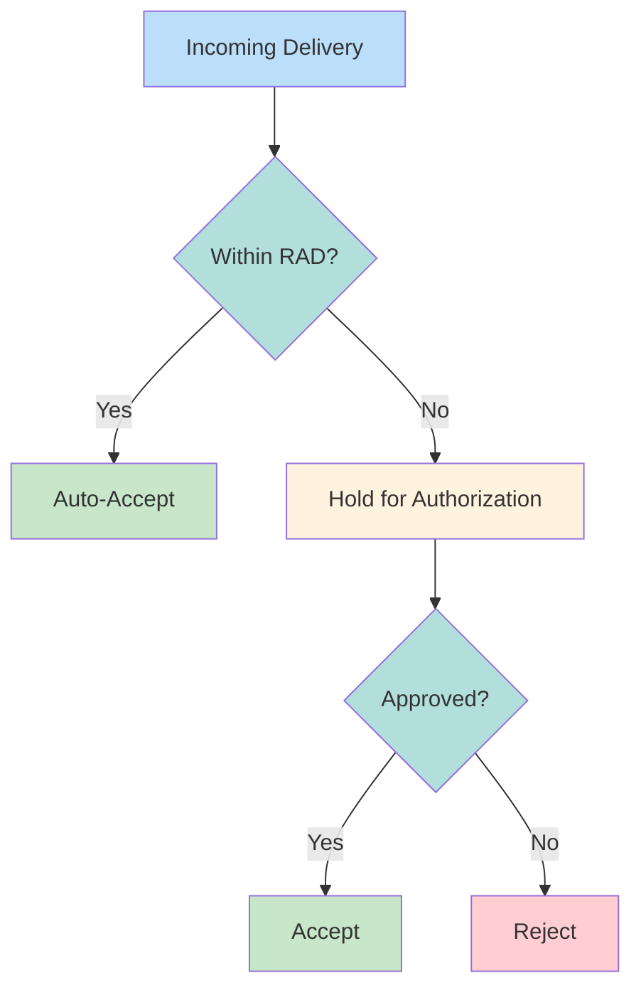

# RAD Thresholds

Receiver Authorized Delivery limits controlling large incoming deliveries.

---

## Purpose

| Function | Description |
|----------|-------------|
| Prevent "dumping" | Block unwanted large deliveries |
| Balance sheet control | Receiver controls exposure |
| Authorization | Large deliveries need approval |

---

## Threshold Structure

| Category | Typical Limit |
|----------|---------------|
| Per-security | Member-defined |
| Per-counterparty | Member-defined |
| Daily aggregate | Member-defined |

> [!info] Member-Configured
> Each member sets own RAD thresholds based on risk appetite.

---

## RAD Behavior

---

## Exemptions

| Scenario | RAD Applied? |
|----------|--------------|
| Matched [[reclaims]] | Exempt |
| Unmatched reclaims | Subject to RAD |
| Regular deliveries | Subject to RAD |

---

## Related
- [[ims-profiles]] - IMS profile system
- [[reclaims]] - Reclaim RAD behavior
- [[collateral-monitor]] - Complementary control
