# Close-Out Matrix

Quick reference for all Reg SHO close-out deadlines.

---

## Standard Close-Outs

| Position Type | Deadline | Timing | Consequence |
|---------------|----------|--------|-------------|
| **Short sale** | S+1 | Market open (9:30 AM) | [[penalty-box]] |
| **Long sale** | S+3 | Market open (9:30 AM) | [[penalty-box]] |
| **Market maker** | S+3 | Extended | [[penalty-box]] |
| **[[threshold-securities\|Threshold]]** | S+13 | Intraday | Mandatory purchase |

---

## Visual Timeline

```mermaid
gantt
    title Close-Out Deadlines from Settlement Date
    dateFormat X
    axisFormat Day %d

    section Short Sale
    Settlement     :s1, 0, 1d
    Close-Out      :crit, 1, 1d

    section Long Sale
    Settlement     :s2, 0, 1d
    Grace          :g2, 1, 2d
    Close-Out      :crit, 3, 1d

    section Threshold
    Settlement     :s3, 0, 1d
    Consecutive    :active, 1, 12d
    Purchase       :crit, 13, 1d
```

---

## Capital Deduction Timeline

| Age | Deduction | Reference |
|-----|-----------|-----------|
| S+5 | Begins | [[aged-fail-deductions]] |
| S+7 | 15% | [[aged-fail-deductions]] |
| S+14 | 25% | [[aged-fail-deductions]] |
| S+21 | 100% | [[aged-fail-deductions]] |

---

## Resolution Requirements

| Deadline | Acceptable Resolution |
|----------|----------------------|
| S+1/S+3 | "Cleared and settled" delivery |
| S+13 (Threshold) | **Purchase only** (borrow NOT acceptable) |

---

## Related
- [[reg-sho-rule-204]] - Full rule details
- [[penalty-box]] - Consequence of miss
- [[threshold-securities]] - 13-day rule
- [[t1-critical-deadlines]] - All deadlines
