# T+1 Critical Deadlines

All critical cutoff times for T+1 settlement cycle.

---

## Timeline Overview

```mermaid
gantt
    title T+1 Settlement Timeline
    dateFormat HH:mm
    axisFormat %H:%M

    section Trade Date (T)
    Market Open            :09:30, 30m
    Market Hours           :10:00, 6h
    Market Close           :16:00, 30m
    Affirmation Deadline   :crit, 21:00, 15m
    CNS Exemption Cutoff   :crit, 22:45, 15m
    Bona Fide Recall       :crit, 23:59, 1m

    section Settlement Date (S)
    Night Cycle Start      :active, 23:30, 2h30m
    Day Cycle Start        :06:00, 9h
    Settlement Cutoff      :crit, 15:00, 30m
    Money Settlement       :15:30, 30m
```

---

## Trade Date (T)

| Time (ET) | Event | Impact |
|-----------|-------|--------|
| 9:30 AM | Market open | Trading begins |
| 4:00 PM | Market close | Regular session ends |
| **9:00 PM** | Affirmation deadline | Institutional trades must be affirmed |
| **10:45 PM** | CNS exemption cutoff | Last IMS hold requests |
| **11:59 PM** | Bona fide recall deadline | [[recalls]] must be received |

---

## Settlement Date (S = T+1)

| Time (ET) | Event | Impact |
|-----------|-------|--------|
| ~11:30 PM (T) | [[night-cycle]] start | ~50% volume allocated |
| ~2:00 AM | Night cycle complete | Results to IMS |
| 6:00 AM | [[day-cycle]] start | Continuous allocation |
| **3:00 PM** | Settlement cutoff | Fails established |
| 3:30 PM | Money settlement | Federal Reserve NSS |

---

## Regulatory Deadlines

| Deadline | Timing | Reference |
|----------|--------|-----------|
| Short close-out | S+1 market open | [[reg-sho-rule-204]] |
| Long close-out | S+3 market open | [[reg-sho-rule-204]] |
| Threshold close-out | S+13 | [[threshold-securities]] |
| Capital deduction start | S+5 | [[aged-fail-deductions]] |
| 100% haircut | S+21 | [[aged-fail-deductions]] |

---

## Quick Reference Card

| Category | Critical Time |
|----------|---------------|
| Affirmation | 9:00 PM T |
| CNS Exemption | 10:45 PM T |
| Recall | 11:59 PM T |
| Settlement | 3:00 PM S |
| Short Close-Out | 9:30 AM S+1 |
| Long Close-Out | 9:30 AM S+3 |

---

## Related
- [[settlement-lifecycle]] - 8-node decision tree
- [[night-cycle]] - Night allocation
- [[day-cycle]] - Day allocation
- [[close-out-matrix]] - Regulatory deadlines
